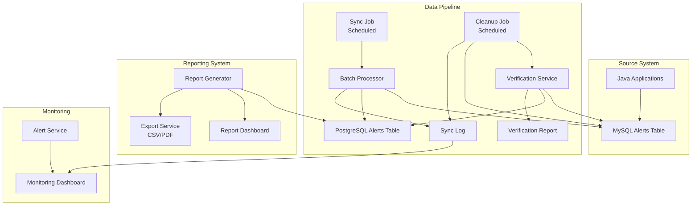
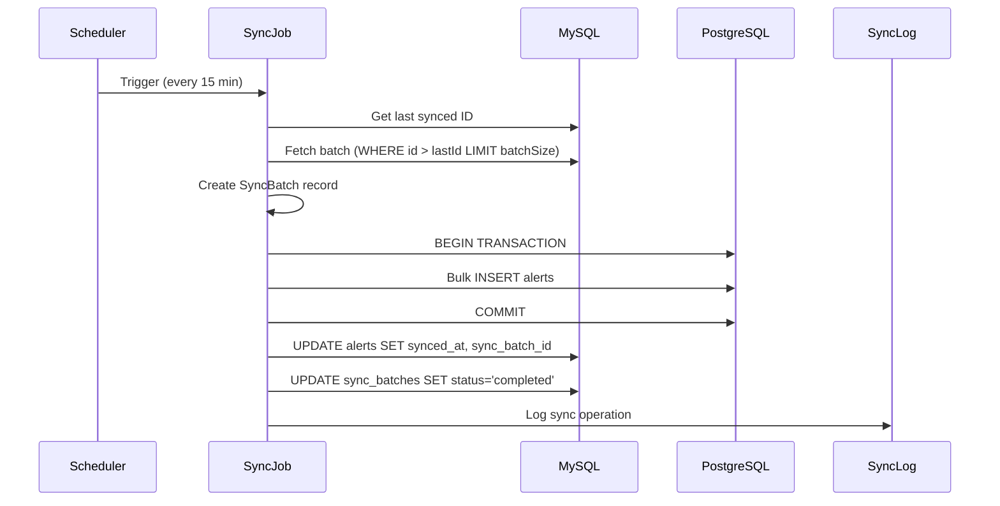
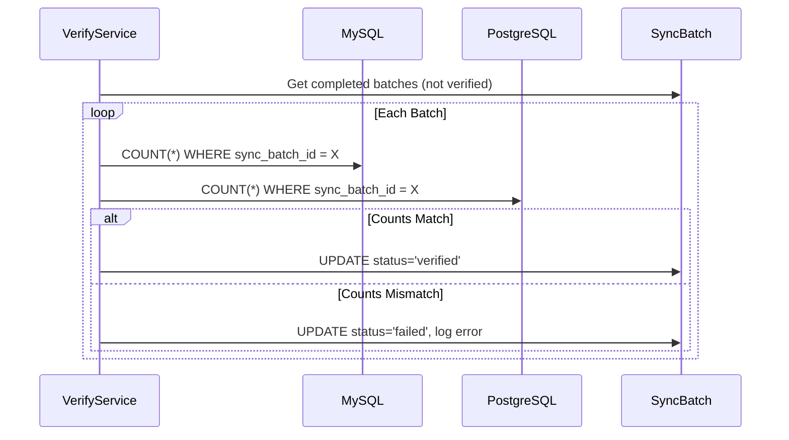
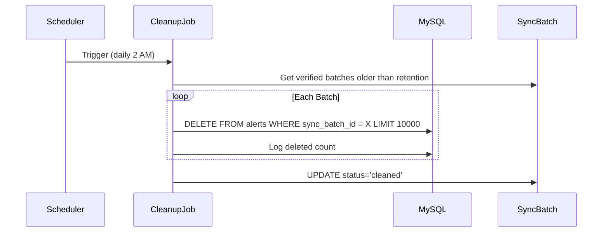

# Design Document: Alerts Data Pipeline

## Overview

This design outlines a data pipeline system for synchronizing ATM monitoring alerts from MySQL to PostgreSQL, enabling report generation without impacting the production MySQL database. The system handles 2-3 million records through batch processing, provides data verification before cleanup, and includes comprehensive monitoring and error recovery mechanisms.

## Architecture

The system follows a pipeline architecture with clear separation between sync, verification, cleanup, and reporting components:



### Technology Stack

- **Backend**: Laravel 10+ with Queue system for background jobs
- **Frontend**: React 18+ with Tailwind CSS for monitoring dashboard
- **Source Database**: MySQL 8+ (existing alerts table)
- **Target Database**: PostgreSQL 14+ (reporting database)
- **Queue System**: Laravel Horizon with Redis for job management
- **Scheduling**: Laravel Task Scheduler (cron-based)
- **Logging**: Laravel logging with database-backed sync logs

## Components and Interfaces

### Backend Components

#### SyncJob (Scheduled Job)
```php
interface SyncJobInterface
{
    public function handle(): void;
    public function getBatchSize(): int;
    public function getLastSyncedId(): int;
    public function checkpoint(int $lastProcessedId): void;
}
```
- Runs on configurable schedule (default: every 15 minutes)
- Fetches unsynced records from MySQL in batches
- Inserts records into PostgreSQL with transaction safety
- Updates sync markers and logs progress

#### BatchProcessor
```php
interface BatchProcessorInterface
{
    public function processBatch(int $startId, int $batchSize): BatchResult;
    public function rollbackBatch(int $batchId): void;
    public function retryFailedBatch(int $batchId): BatchResult;
}

class BatchResult
{
    public int $recordsProcessed;
    public int $lastProcessedId;
    public bool $success;
    public ?string $errorMessage;
}
```
- Handles chunked data transfer
- Implements transaction boundaries per batch
- Provides rollback capability for failed batches

#### VerificationService
```php
interface VerificationServiceInterface
{
    public function verifyBatch(int $startId, int $endId): VerificationResult;
    public function verifyRecordExists(int $recordId): bool;
    public function generateVerificationReport(DateRange $range): VerificationReport;
}

class VerificationResult
{
    public int $sourceCount;
    public int $targetCount;
    public array $missingIds;
    public bool $verified;
}
```
- Compares record counts between databases
- Validates individual record existence
- Generates verification reports

#### CleanupJob (Scheduled Job)
```php
interface CleanupJobInterface
{
    public function handle(): void;
    public function getRetentionDays(): int;
    public function cleanupBatch(array $recordIds): CleanupResult;
}

class CleanupResult
{
    public int $recordsDeleted;
    public int $recordsSkipped;
    public array $errors;
}
```
- Runs on configurable schedule (default: daily at 2 AM)
- Only deletes verified synced records
- Respects retention period configuration
- Deletes in batches to prevent long locks

#### ReportGenerator
```php
interface ReportGeneratorInterface
{
    public function generateDailyReport(Carbon $date): Report;
    public function generateSummaryReport(DateRange $range): Report;
    public function exportToCsv(Report $report): string;
    public function exportToPdf(Report $report): string;
}
```
- Queries PostgreSQL exclusively for report data
- Supports filtering by date, type, severity
- Generates summary statistics

### Frontend Components

#### SyncDashboard Component
- Real-time sync status display (idle/running/failed)
- Progress indicators for active sync jobs
- Historical sync statistics and charts

#### ReportingDashboard Component
- Report generation interface
- Filter controls (date range, alert type, severity)
- Export buttons for CSV/PDF

#### ConfigurationPanel Component
- Batch size configuration
- Schedule configuration (sync and cleanup)
- Retention period settings

### API Endpoints

```
GET  /api/pipeline/status          - Current pipeline status
GET  /api/pipeline/sync-logs       - Sync history with pagination
POST /api/pipeline/sync/trigger    - Manually trigger sync
POST /api/pipeline/cleanup/trigger - Manually trigger cleanup

GET  /api/reports/daily            - Generate daily report
GET  /api/reports/summary          - Generate summary report
GET  /api/reports/export/csv       - Export report as CSV
GET  /api/reports/export/pdf       - Export report as PDF

GET  /api/config/pipeline          - Get pipeline configuration
PUT  /api/config/pipeline          - Update pipeline configuration
```

## Data Models

### MySQL Database (Source)

```sql
-- Existing alerts table (structure may vary based on your schema)
-- Adding sync tracking columns
ALTER TABLE alerts ADD COLUMN synced_at TIMESTAMP NULL;
ALTER TABLE alerts ADD COLUMN sync_batch_id BIGINT NULL;
ALTER TABLE alerts ADD INDEX idx_synced_at (synced_at);
ALTER TABLE alerts ADD INDEX idx_sync_batch_id (sync_batch_id);

-- Sync tracking table
CREATE TABLE sync_batches (
    id BIGINT UNSIGNED AUTO_INCREMENT PRIMARY KEY,
    start_id BIGINT NOT NULL,
    end_id BIGINT NOT NULL,
    records_count INT NOT NULL,
    status ENUM('pending', 'processing', 'completed', 'failed', 'verified') DEFAULT 'pending',
    started_at TIMESTAMP NULL,
    completed_at TIMESTAMP NULL,
    verified_at TIMESTAMP NULL,
    error_message TEXT NULL,
    created_at TIMESTAMP DEFAULT CURRENT_TIMESTAMP,
    INDEX idx_status (status),
    INDEX idx_created_at (created_at)
);

-- Sync configuration table
CREATE TABLE sync_config (
    id INT UNSIGNED AUTO_INCREMENT PRIMARY KEY,
    config_key VARCHAR(100) UNIQUE NOT NULL,
    config_value TEXT NOT NULL,
    updated_at TIMESTAMP DEFAULT CURRENT_TIMESTAMP ON UPDATE CURRENT_TIMESTAMP
);
```

### PostgreSQL Database (Target)

```sql
-- Replicated alerts table (mirror of MySQL structure)
CREATE TABLE alerts (
    id BIGINT PRIMARY KEY,  -- Same ID as MySQL, not auto-generated
    -- Your existing alert columns here
    terminal_id VARCHAR(50),
    alert_type VARCHAR(100) NOT NULL,
    alert_code VARCHAR(50),
    message TEXT,
    severity VARCHAR(20) DEFAULT 'medium',
    source_system VARCHAR(100),
    created_at TIMESTAMP NOT NULL,
    resolved_at TIMESTAMP NULL,
    metadata JSONB,
    -- Sync metadata
    synced_at TIMESTAMP DEFAULT NOW(),
    sync_batch_id BIGINT NOT NULL
);

CREATE INDEX idx_alerts_terminal_id ON alerts (terminal_id);
CREATE INDEX idx_alerts_alert_type ON alerts (alert_type);
CREATE INDEX idx_alerts_severity ON alerts (severity);
CREATE INDEX idx_alerts_created_at ON alerts (created_at);
CREATE INDEX idx_alerts_synced_at ON alerts (synced_at);
CREATE INDEX idx_alerts_sync_batch_id ON alerts (sync_batch_id);

-- Sync logs table (for reporting on sync operations)
CREATE TABLE sync_logs (
    id SERIAL PRIMARY KEY,
    batch_id BIGINT NOT NULL,
    operation VARCHAR(20) NOT NULL,  -- 'sync', 'verify', 'cleanup'
    records_affected INT NOT NULL,
    status VARCHAR(20) NOT NULL,
    duration_ms INT,
    error_message TEXT,
    created_at TIMESTAMP DEFAULT NOW()
);

CREATE INDEX idx_sync_logs_batch_id ON sync_logs (batch_id);
CREATE INDEX idx_sync_logs_created_at ON sync_logs (created_at);

-- Daily report cache table
CREATE TABLE daily_report_cache (
    id SERIAL PRIMARY KEY,
    report_date DATE NOT NULL UNIQUE,
    total_alerts INT NOT NULL,
    alerts_by_type JSONB,
    alerts_by_severity JSONB,
    alerts_by_terminal JSONB,
    generated_at TIMESTAMP DEFAULT NOW()
);
```

### Laravel Models

```php
// MySQL Models
class Alert extends Model
{
    protected $connection = 'mysql';
    protected $table = 'alerts';
    
    public function scopeUnsynced($query)
    {
        return $query->whereNull('synced_at');
    }
    
    public function scopeSyncedAndVerified($query)
    {
        return $query->whereNotNull('synced_at')
            ->whereHas('syncBatch', fn($q) => $q->where('status', 'verified'));
    }
}

class SyncBatch extends Model
{
    protected $connection = 'mysql';
    protected $table = 'sync_batches';
}

// PostgreSQL Models
class SyncedAlert extends Model
{
    protected $connection = 'pgsql';
    protected $table = 'alerts';
    public $incrementing = false;  // ID comes from MySQL
}

class SyncLog extends Model
{
    protected $connection = 'pgsql';
    protected $table = 'sync_logs';
}
```

## Data Flow

### Sync Flow


### Verification Flow


### Cleanup Flow



## Correctness Properties

*A property is a characteristic or behavior that should hold true across all valid executions of a system-essentially, a formal statement about what the system should do. Properties serve as the bridge between human-readable specifications and machine-verifiable correctness guarantees.*

Based on the prework analysis, the following correctness properties have been identified:

### Property 1: Data Preservation on Sync
*For any* alert record synced from MySQL to PostgreSQL, the PostgreSQL record SHALL contain identical data to the original MySQL record (excluding sync metadata fields).
**Validates: Requirements 1.2**

### Property 2: Sync Marker Consistency
*For any* record that exists in PostgreSQL with a given sync_batch_id, the corresponding MySQL record SHALL have a non-null synced_at timestamp and matching sync_batch_id.
**Validates: Requirements 1.3**

### Property 3: Transaction Rollback on Failure
*For any* sync batch that encounters a failure during PostgreSQL insertion, the batch SHALL be rolled back completely with zero partial records in PostgreSQL and zero sync markers updated in MySQL.
**Validates: Requirements 1.4, 7.2**

### Property 4: Sync Log Completeness
*For any* sync or cleanup operation (successful or failed), the sync log SHALL contain: start_time, end_time, records_affected, status, and error_message (if failed).
**Validates: Requirements 2.1, 2.4, 4.4**

### Property 5: Verification Accuracy
*For any* synced batch, the verification service SHALL correctly report whether the MySQL source count equals the PostgreSQL target count for that batch.
**Validates: Requirements 3.1**

### Property 6: Cleanup Safety Gate
*For any* record deleted from MySQL by the cleanup job, that record SHALL have been: (a) successfully synced to PostgreSQL, (b) verified by the verification service, and (c) older than the configured retention period.
**Validates: Requirements 3.2, 3.3, 3.5, 4.1, 4.2**

### Property 7: Report Filter Accuracy
*For any* report query with filters (date range, alert type, severity), all returned records SHALL match ALL specified filter criteria.
**Validates: Requirements 5.2**

### Property 8: Report Statistics Correctness
*For any* generated report, the summary statistics (counts by type, counts by severity) SHALL equal the actual counts when computed directly from the underlying data.
**Validates: Requirements 5.3**

### Property 9: Checkpoint Resume Correctness
*For any* sync job that is interrupted and resumed, the resumed job SHALL continue from the last checkpointed ID without re-processing already-synced records or skipping unsynced records.
**Validates: Requirements 7.3**

### Property 10: Connection Failure Retry
*For any* database connection failure during sync, the system SHALL retry the operation with increasing delays (exponential backoff) up to a maximum retry count before marking the batch as failed.
**Validates: Requirements 7.1**

## Error Handling

### Sync Job Error Handling

| Error Type | Detection | Response | Recovery |
|------------|-----------|----------|----------|
| MySQL connection failure | PDOException | Log error, retry with backoff | Resume from last checkpoint |
| PostgreSQL connection failure | PDOException | Rollback batch, retry | Retry same batch |
| Memory exhaustion | Memory limit exception | Reduce batch size, checkpoint | Resume with smaller batch |
| Timeout | Job timeout | Checkpoint progress | Resume on next scheduled run |
| Data integrity error | Constraint violation | Log affected records | Add to error queue |

### Cleanup Job Error Handling

| Error Type | Detection | Response | Recovery |
|------------|-----------|----------|----------|
| Verification failure | Count mismatch | Skip batch, alert admin | Manual investigation |
| MySQL connection failure | PDOException | Stop cleanup, log state | Resume on next run |
| Long-running transaction | Lock timeout | Reduce batch size | Retry with smaller batch |

### API Error Responses

```php
// Standard error response format
{
    "success": false,
    "error": {
        "code": "SYNC_FAILED",
        "message": "Sync batch failed due to PostgreSQL connection timeout",
        "details": {
            "batch_id": 12345,
            "records_affected": 0,
            "retry_count": 3
        }
    }
}
```

### Alert Thresholds

- **Warning**: 3 consecutive batch failures
- **Critical**: 5 consecutive batch failures or sync lag > 1 hour
- **Emergency**: Verification failure detected (potential data loss)

## Testing Strategy

### Dual Testing Approach

This project uses both unit testing and property-based testing for comprehensive coverage:

**Unit Tests** (PHPUnit):
- Specific examples of sync operations
- Database connection establishment
- API endpoint responses
- Error handling for specific failure scenarios
- Configuration loading and validation

**Property Tests** (PHPUnit with data providers for property-based testing):
- Universal properties that hold across all inputs
- Data integrity across sync operations
- Filter accuracy across all filter combinations
- Statistics correctness across various datasets

### Testing Framework Configuration

**Backend Testing (Laravel/PHPUnit)**:
- PHPUnit for unit and feature testing
- Laravel's database testing with transactions
- Separate test databases for MySQL and PostgreSQL
- Minimum 100 iterations for property-based tests using data providers
- Faker for generating realistic test data

**Property Test Implementation Pattern**:
```php
/**
 * @dataProvider syncDataProvider
 * Feature: alerts-data-pipeline, Property 1: Data Preservation on Sync
 * Validates: Requirements 1.2
 */
public function test_synced_data_preserves_original_values($alertData)
{
    // Create alert in MySQL
    $mysqlAlert = Alert::create($alertData);
    
    // Run sync
    $this->artisan('pipeline:sync');
    
    // Verify PostgreSQL has identical data
    $pgsqlAlert = SyncedAlert::find($mysqlAlert->id);
    
    $this->assertEquals($mysqlAlert->terminal_id, $pgsqlAlert->terminal_id);
    $this->assertEquals($mysqlAlert->alert_type, $pgsqlAlert->alert_type);
    $this->assertEquals($mysqlAlert->message, $pgsqlAlert->message);
    // ... all fields
}

public function syncDataProvider(): array
{
    return array_map(fn() => [
        [
            'terminal_id' => fake()->regexify('[A-Z]{3}[0-9]{5}'),
            'alert_type' => fake()->randomElement(['CASH_LOW', 'OFFLINE', 'PAPER_JAM', 'CARD_READER_ERROR']),
            'message' => fake()->sentence(),
            'severity' => fake()->randomElement(['low', 'medium', 'high', 'critical']),
            'created_at' => fake()->dateTimeBetween('-30 days', 'now'),
        ]
    ], range(1, 100));
}
```

### Test Categories

1. **Sync Tests**
   - Property 1: Data preservation
   - Property 2: Sync marker consistency
   - Property 3: Transaction rollback

2. **Verification Tests**
   - Property 5: Verification accuracy
   - Property 6: Cleanup safety gate

3. **Reporting Tests**
   - Property 7: Filter accuracy
   - Property 8: Statistics correctness

4. **Resilience Tests**
   - Property 9: Checkpoint resume
   - Property 10: Connection failure retry

5. **Integration Tests**
   - End-to-end sync flow
   - Complete cleanup cycle
   - Report generation from synced data

### Property Test Tags

Each property test will be tagged with comments referencing this design document:
- **Feature: alerts-data-pipeline, Property 1: Data Preservation on Sync**
- **Feature: alerts-data-pipeline, Property 2: Sync Marker Consistency**
- **Feature: alerts-data-pipeline, Property 3: Transaction Rollback on Failure**
- **Feature: alerts-data-pipeline, Property 4: Sync Log Completeness**
- **Feature: alerts-data-pipeline, Property 5: Verification Accuracy**
- **Feature: alerts-data-pipeline, Property 6: Cleanup Safety Gate**
- **Feature: alerts-data-pipeline, Property 7: Report Filter Accuracy**
- **Feature: alerts-data-pipeline, Property 8: Report Statistics Correctness**
- **Feature: alerts-data-pipeline, Property 9: Checkpoint Resume Correctness**
- **Feature: alerts-data-pipeline, Property 10: Connection Failure Retry**
