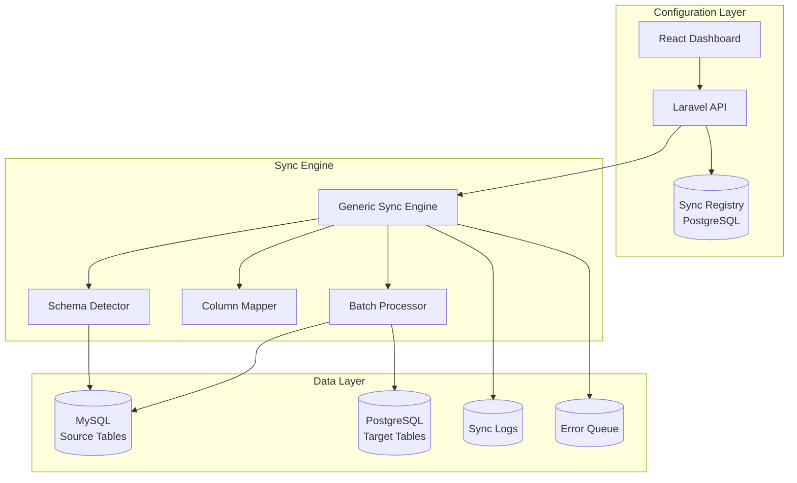

# Design Document: Configurable Table Sync Module

## Overview

This design describes a generic, configurable table synchronization module that enables one-way data transfer from any MySQL table to PostgreSQL. The module extends the existing dual-database Laravel application with a flexible sync engine that accepts table configurations at runtime, handles schema detection and mapping, and maintains data integrity without deleting source records.

The architecture follows a registry-based pattern where table sync configurations are stored in PostgreSQL and processed by a generic sync engine that adapts to each table's schema dynamically.

## Architecture



## Components and Interfaces

### 1. TableSyncConfiguration Model

Stores sync configuration for each table in PostgreSQL.

```php
interface TableSyncConfigurationInterface
{
    public function getSourceTable(): string;
    public function getTargetTable(): string;
    public function getPrimaryKeyColumn(): string;
    public function getColumnMappings(): array;
    public function getExcludedColumns(): array;
    public function getBatchSize(): int;
    public function getSchedule(): ?string;
    public function isEnabled(): bool;
}
```

### 2. SchemaDetectorService

Detects and analyzes MySQL table schema.

```php
interface SchemaDetectorInterface
{
    public function tableExists(string $tableName, string $connection = 'mysql'): bool;
    public function getTableSchema(string $tableName, string $connection = 'mysql'): array;
    public function getColumnTypes(string $tableName, string $connection = 'mysql'): array;
    public function getPrimaryKey(string $tableName, string $connection = 'mysql'): ?string;
}
```

### 3. ColumnMapperService

Handles column mapping and type conversion between MySQL and PostgreSQL.

```php
interface ColumnMapperInterface
{
    public function mapColumns(array $sourceRow, array $mappings, array $excluded): array;
    public function convertType(mixed $value, string $mysqlType, string $postgresType): mixed;
    public function generateTargetSchema(array $sourceSchema, array $mappings): array;
}
```

### 4. GenericSyncService

The main sync engine that processes any configured table.

```php
interface GenericSyncInterface
{
    public function syncTable(string $configId): SyncResult;
    public function syncAllTables(): array;
    public function getUnsyncedCount(string $configId): int;
    public function getSyncStatus(string $configId): string;
    public function addSyncMarkerColumn(string $tableName): bool;
}
```

### 5. TableSyncController

REST API controller for managing configurations and triggering syncs.

```php
// API Endpoints
POST   /api/table-sync/configurations     // Create new table sync config
GET    /api/table-sync/configurations     // List all configurations
GET    /api/table-sync/configurations/{id} // Get specific configuration
PUT    /api/table-sync/configurations/{id} // Update configuration
DELETE /api/table-sync/configurations/{id} // Delete configuration
POST   /api/table-sync/sync/{id}          // Trigger sync for specific table
POST   /api/table-sync/sync-all           // Trigger sync for all enabled tables
GET    /api/table-sync/status/{id}        // Get sync status for table
GET    /api/table-sync/logs               // Get sync logs with filters
```

## Data Models

### TableSyncConfiguration (PostgreSQL)

```sql
CREATE TABLE table_sync_configurations (
    id SERIAL PRIMARY KEY,
    name VARCHAR(255) NOT NULL,
    source_table VARCHAR(255) NOT NULL,
    target_table VARCHAR(255) NOT NULL,
    primary_key_column VARCHAR(255) DEFAULT 'id',
    sync_marker_column VARCHAR(255) DEFAULT 'synced_at',
    column_mappings JSONB DEFAULT '{}',
    excluded_columns JSONB DEFAULT '[]',
    batch_size INTEGER DEFAULT 10000,
    schedule VARCHAR(100) NULL,
    is_enabled BOOLEAN DEFAULT true,
    last_sync_at TIMESTAMP NULL,
    last_sync_status VARCHAR(50) NULL,
    created_at TIMESTAMP DEFAULT CURRENT_TIMESTAMP,
    updated_at TIMESTAMP DEFAULT CURRENT_TIMESTAMP,
    UNIQUE(source_table)
);
```

### TableSyncLog (PostgreSQL)

```sql
CREATE TABLE table_sync_logs (
    id SERIAL PRIMARY KEY,
    configuration_id INTEGER REFERENCES table_sync_configurations(id),
    source_table VARCHAR(255) NOT NULL,
    records_synced INTEGER DEFAULT 0,
    records_failed INTEGER DEFAULT 0,
    start_id BIGINT NULL,
    end_id BIGINT NULL,
    status VARCHAR(50) NOT NULL,
    error_message TEXT NULL,
    duration_ms INTEGER NULL,
    started_at TIMESTAMP NOT NULL,
    completed_at TIMESTAMP NULL,
    created_at TIMESTAMP DEFAULT CURRENT_TIMESTAMP
);
```

### TableSyncError (PostgreSQL)

```sql
CREATE TABLE table_sync_errors (
    id SERIAL PRIMARY KEY,
    configuration_id INTEGER REFERENCES table_sync_configurations(id),
    source_table VARCHAR(255) NOT NULL,
    record_id BIGINT NOT NULL,
    record_data JSONB NOT NULL,
    error_message TEXT NOT NULL,
    retry_count INTEGER DEFAULT 0,
    last_retry_at TIMESTAMP NULL,
    resolved_at TIMESTAMP NULL,
    created_at TIMESTAMP DEFAULT CURRENT_TIMESTAMP
);
```

## MySQL Type to PostgreSQL Type Mapping

| MySQL Type | PostgreSQL Type |
|------------|-----------------|
| TINYINT | SMALLINT |
| SMALLINT | SMALLINT |
| MEDIUMINT | INTEGER |
| INT/INTEGER | INTEGER |
| BIGINT | BIGINT |
| FLOAT | REAL |
| DOUBLE | DOUBLE PRECISION |
| DECIMAL | DECIMAL |
| VARCHAR | VARCHAR |
| CHAR | CHAR |
| TEXT | TEXT |
| MEDIUMTEXT | TEXT |
| LONGTEXT | TEXT |
| DATETIME | TIMESTAMP |
| TIMESTAMP | TIMESTAMP |
| DATE | DATE |
| TIME | TIME |
| TINYINT(1) | BOOLEAN |
| BLOB | BYTEA |
| JSON | JSONB |
| ENUM | VARCHAR |


## Correctness Properties

*A property is a characteristic or behavior that should hold true across all valid executions of a system—essentially, a formal statement about what the system should do. Properties serve as the bridge between human-readable specifications and machine-verifiable correctness guarantees.*

### Property 1: Configuration Round-Trip Consistency

*For any* valid table sync configuration, storing it in the registry and then retrieving it SHALL produce an equivalent configuration object with all fields preserved.

**Validates: Requirements 1.4, 8.6**

### Property 2: Schema Detection Accuracy

*For any* existing MySQL table, the detected schema SHALL accurately reflect all columns, their data types, and the primary key as defined in the actual table structure.

**Validates: Requirements 1.3**

### Property 3: Column Mapping Correctness

*For any* source row and column mapping configuration:
- With no custom mappings, target columns SHALL have identical names and values to source
- With custom mappings, target columns SHALL have renamed columns with correct values
- With excluded columns, those columns SHALL NOT appear in the target row

**Validates: Requirements 2.1, 2.2, 2.3**

### Property 4: Data Type Conversion Preservation

*For any* MySQL data value and its type, converting to the corresponding PostgreSQL type SHALL preserve the semantic value (numbers remain equal, strings remain equal, dates remain equivalent).

**Validates: Requirements 2.5**

### Property 5: NULL Value Preservation

*For any* source row containing NULL values in any column, those NULL values SHALL be preserved exactly in the corresponding target row columns.

**Validates: Requirements 2.6**

### Property 6: Source Data Preservation (Critical)

*For any* sync operation on any configured table, the record count in the MySQL source table SHALL remain unchanged or increase (never decrease). No records SHALL be deleted from the source table.

**Validates: Requirements 3.4**

### Property 7: Sync Marker Consistency

*For any* record in the source table:
- If synced_at is NULL, the record SHALL be eligible for sync
- After successful sync, synced_at SHALL be non-NULL with a valid timestamp
- The record SHALL exist in the target table if and only if synced_at is non-NULL

**Validates: Requirements 3.2, 3.3**

### Property 8: Batch Transaction Atomicity

*For any* batch of records being synced, either ALL records in the batch are successfully inserted into PostgreSQL and marked as synced in MySQL, OR NONE of them are (complete rollback on failure).

**Validates: Requirements 4.2**

### Property 9: Batch Isolation on Failure

*For any* failed batch during a multi-batch sync operation, all previously completed batches SHALL remain intact in PostgreSQL with their sync markers preserved in MySQL.

**Validates: Requirements 4.3**

### Property 10: Sync Logging Completeness

*For any* sync operation (successful or failed), a log entry SHALL exist containing: configuration ID, table name, records synced count, status, duration, and (if failed) error message with affected record range.

**Validates: Requirements 6.1, 6.4**

### Property 11: Concurrent Sync Prevention

*For any* table configuration, if a sync is currently running, any concurrent sync attempt for the same table SHALL be blocked or queued, never executed simultaneously.

**Validates: Requirements 5.4**

### Property 12: Error Queue Population

*For any* record that fails to sync after the configured retry attempts, it SHALL appear in the error queue with the record data, error message, and retry count preserved.

**Validates: Requirements 7.4**

## Error Handling

### Connection Failures

| Error Type | Handling Strategy |
|------------|-------------------|
| MySQL connection failure | Retry with exponential backoff (1s, 2s, 4s, 8s, max 30s), max 5 attempts |
| PostgreSQL connection failure | Rollback current batch, retry with exponential backoff |
| Connection timeout | Treat as connection failure, apply retry logic |

### Data Errors

| Error Type | Handling Strategy |
|------------|-------------------|
| Invalid data type | Log error, add to error queue, skip record, continue batch |
| Constraint violation | Log error, add to error queue, skip record, continue batch |
| Duplicate key | Check if already synced, skip if duplicate, log warning |

### Configuration Errors

| Error Type | Handling Strategy |
|------------|-------------------|
| Source table not found | Fail immediately with descriptive error |
| Invalid column mapping | Reject configuration, return validation errors |
| Missing primary key | Fail configuration validation |

### Threshold-Based Alerts

- Warning: 3 consecutive batch failures
- Critical: 5 consecutive batch failures → pause sync, send alert
- Error queue threshold: 100 records → send alert

## Testing Strategy

### Unit Tests

Unit tests will verify specific examples and edge cases:

1. Schema detection for various MySQL table structures
2. Column mapping with different configuration scenarios
3. Data type conversion for all supported MySQL types
4. Configuration validation with valid and invalid inputs
5. Batch size boundary conditions

### Property-Based Tests

Property-based tests will use PHPUnit with a custom property testing approach (using data providers with randomized inputs) to verify universal properties:

1. **Configuration round-trip test** - Generate random valid configurations, store and retrieve
2. **Column mapping test** - Generate random rows with various mapping configurations
3. **NULL preservation test** - Generate rows with random NULL patterns
4. **Source data preservation test** - Verify source count never decreases after sync
5. **Sync marker consistency test** - Verify marker state matches sync state
6. **Batch atomicity test** - Simulate failures mid-batch, verify rollback
7. **Concurrent sync prevention test** - Attempt concurrent syncs, verify blocking

### Test Configuration

- Minimum 100 iterations per property test
- Use SQLite in-memory for fast test execution where possible
- Use test database containers for integration tests
- Tag format: **Feature: configurable-table-sync, Property {number}: {property_text}**

### Integration Tests

1. End-to-end sync of a test table from MySQL to PostgreSQL
2. API endpoint tests for all CRUD operations
3. Scheduled sync execution verification
4. Error queue workflow (fail → queue → retry → success)
