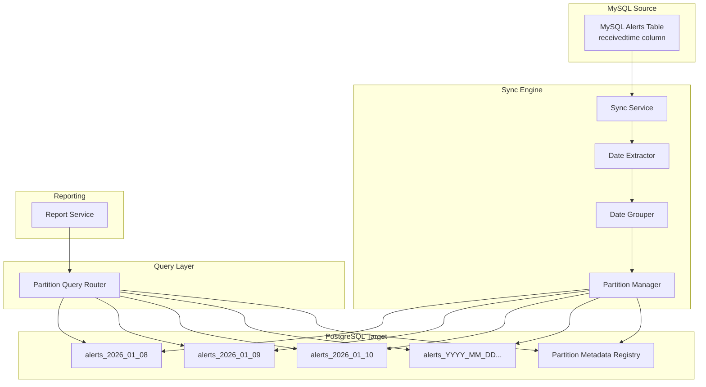
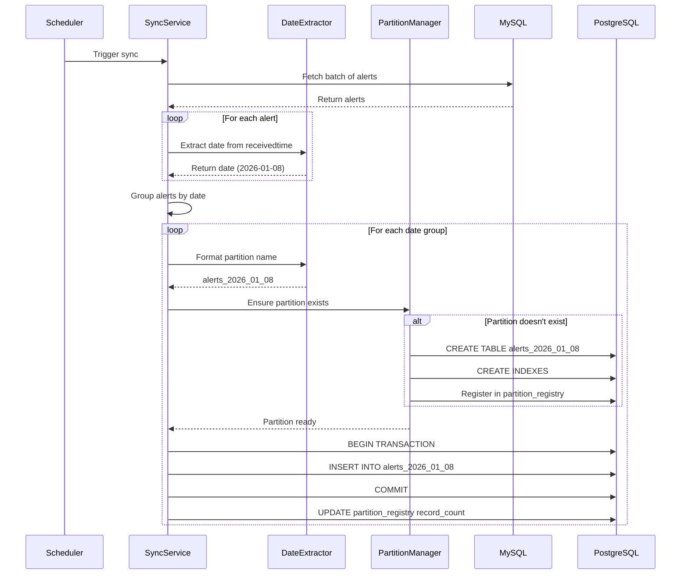
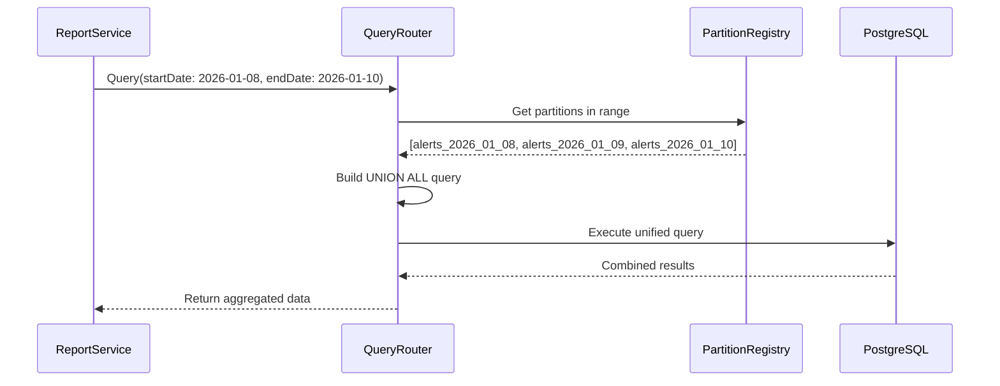

# Design Document: Date-Partitioned Alerts Sync

## Overview

This design implements a date-partitioned synchronization system that reads alert records from MySQL and distributes them into date-specific PostgreSQL tables. Each day's alerts are stored in a separate table (e.g., `alerts_2026_01_08`), enabling efficient date-range queries and simplified data archival. The system automatically creates partition tables as needed and provides a unified query interface for cross-partition reporting.

## Architecture

The system extends the existing sync pipeline with partition management capabilities:



### Technology Stack

- **Backend**: Laravel 10+ with existing sync infrastructure
- **Source Database**: MySQL 8+ (read-only access to alerts table)
- **Target Database**: PostgreSQL 14+ (date-partitioned tables)
- **Schema Management**: Laravel migrations and dynamic DDL
- **Query Routing**: Custom partition-aware query builder

## Components and Interfaces

### Core Components

#### DateExtractor
```php
interface DateExtractorInterface
{
    public function extractDate(string $receivedtime): Carbon;
    public function formatPartitionName(Carbon $date): string;
    public function parsePartitionName(string $tableName): Carbon;
}
```
- Extracts date from MySQL `receivedtime` column
- Formats dates as `YYYY_MM_DD` for table names
- Handles timezone conversions consistently

#### PartitionManager
```php
interface PartitionManagerInterface
{
    public function ensurePartitionExists(Carbon $date): bool;
    public function createPartition(Carbon $date): bool;
    public function getPartitionTableName(Carbon $date): string;
    public function listPartitions(): Collection;
    public function getPartitionSchema(): array;
}
```
- Creates partition tables dynamically when needed
- Maintains schema consistency across partitions
- Tracks partition metadata in registry

#### DateGroupedSyncService
```php
interface DateGroupedSyncServiceInterface
{
    public function syncBatch(int $batchSize): SyncResult;
    public function groupAlertsByDate(Collection $alerts): array;
    public function syncDateGroup(Carbon $date, Collection $alerts): DateGroupResult;
}

class DateGroupResult
{
    public Carbon $date;
    public string $partitionTable;
    public int $recordsInserted;
    public bool $success;
    public ?string $errorMessage;
}
```
- Fetches alerts from MySQL in batches
- Groups alerts by extracted date
- Syncs each date group to its partition table

#### PartitionQueryRouter
```php
interface PartitionQueryRouterInterface
{
    public function queryDateRange(Carbon $startDate, Carbon $endDate, array $filters = []): Collection;
    public function getPartitionsInRange(Carbon $startDate, Carbon $endDate): array;
    public function buildUnionQuery(array $partitions, array $filters): string;
}
```
- Routes queries across multiple partition tables
- Builds UNION ALL queries for date ranges
- Handles missing partitions gracefully

#### PartitionMetadataRegistry
```php
interface PartitionMetadataRegistryInterface
{
    public function registerPartition(string $tableName, Carbon $date): void;
    public function getPartitionInfo(string $tableName): ?PartitionMetadata;
    public function updateRecordCount(string $tableName, int $count): void;
    public function getAllPartitions(): Collection;
}

class PartitionMetadata
{
    public string $tableName;
    public Carbon $partitionDate;
    public Carbon $createdAt;
    public int $recordCount;
    public Carbon $lastSyncedAt;
}
```
- Maintains registry of all partition tables
- Tracks creation dates and record counts
- Provides partition discovery for queries

### API Endpoints

```
POST /api/sync/partitioned/trigger    - Trigger date-partitioned sync
GET  /api/sync/partitions              - List all partition tables
GET  /api/sync/partitions/{date}       - Get partition info for specific date
GET  /api/reports/partitioned/query    - Query across date partitions
GET  /api/reports/partitioned/summary  - Summary statistics across partitions
```

## Data Models

### PostgreSQL Partition Tables

```sql
-- Base schema template for all partition tables
-- Each partition table follows this structure: alerts_YYYY_MM_DD

CREATE TABLE alerts_2026_01_08 (
    id BIGINT PRIMARY KEY,  -- Same ID as MySQL
    terminal_id VARCHAR(50),
    alert_type VARCHAR(100) NOT NULL,
    alert_code VARCHAR(50),
    message TEXT,
    severity VARCHAR(20) DEFAULT 'medium',
    source_system VARCHAR(100),
    receivedtime TIMESTAMP NOT NULL,  -- Original MySQL timestamp
    resolved_at TIMESTAMP NULL,
    metadata JSONB,
    -- Sync metadata
    synced_at TIMESTAMP DEFAULT NOW(),
    sync_batch_id BIGINT
);

-- Indexes replicated on each partition
CREATE INDEX idx_alerts_2026_01_08_terminal_id ON alerts_2026_01_08 (terminal_id);
CREATE INDEX idx_alerts_2026_01_08_alert_type ON alerts_2026_01_08 (alert_type);
CREATE INDEX idx_alerts_2026_01_08_severity ON alerts_2026_01_08 (severity);
CREATE INDEX idx_alerts_2026_01_08_receivedtime ON alerts_2026_01_08 (receivedtime);
```

### Partition Metadata Registry Table

```sql
CREATE TABLE partition_registry (
    id SERIAL PRIMARY KEY,
    table_name VARCHAR(100) UNIQUE NOT NULL,
    partition_date DATE NOT NULL,
    record_count BIGINT DEFAULT 0,
    created_at TIMESTAMP DEFAULT NOW(),
    last_synced_at TIMESTAMP,
    INDEX idx_partition_date (partition_date),
    INDEX idx_table_name (table_name)
);
```

### Laravel Models

```php
// Dynamic partition model
class PartitionedAlert extends Model
{
    protected $connection = 'pgsql';
    public $incrementing = false;
    
    public function setTable($tableName)
    {
        $this->table = $tableName;
        return $this;
    }
}

// Partition metadata model
class PartitionRegistry extends Model
{
    protected $connection = 'pgsql';
    protected $table = 'partition_registry';
    protected $casts = [
        'partition_date' => 'date',
        'created_at' => 'datetime',
        'last_synced_at' => 'datetime',
    ];
}
```

## Data Flow

### Sync Flow with Date Partitioning



### Query Flow Across Partitions



## Correctness Properties

*A property is a characteristic or behavior that should hold true across all valid executions of a system-essentially, a formal statement about what the system should do. Properties serve as the bridge between human-readable specifications and machine-verifiable correctness guarantees.*

### Property 1: Date Extraction Consistency
*For any* alert record with a `receivedtime` value, extracting the date and formatting it as a partition name should always produce the same result for the same input timestamp.
**Validates: Requirements 1.1, 1.2, 7.3**

### Property 2: Partition Table Creation Idempotency
*For any* date, calling `ensurePartitionExists` multiple times should result in exactly one partition table being created, with subsequent calls being no-ops.
**Validates: Requirements 2.1, 2.2**

### Property 3: Schema Consistency Across Partitions
*For any* two partition tables created by the system, they should have identical column names, data types, and index definitions.
**Validates: Requirements 3.1, 3.2, 3.3**

### Property 4: Read-Only MySQL Operations
*For any* sync operation, the system should only execute SELECT queries against the MySQL alerts table, never INSERT, UPDATE, DELETE, TRUNCATE, or DROP.
**Validates: Requirements 4.1, 4.2, 4.3, 4.4**

### Property 5: Date Group Insertion Atomicity
*For any* date group of alerts, either all alerts in that group are inserted into the partition table, or none are (transaction rollback on failure).
**Validates: Requirements 5.3, 8.2**

### Property 6: Cross-Partition Query Completeness
*For any* date range query, the results should include all records from all partition tables that fall within the specified date range.
**Validates: Requirements 6.1, 6.2, 6.3, 6.4**

### Property 7: Partition Naming Convention Compliance
*For any* partition table created by the system, the table name should match the format `alerts_YYYY_MM_DD` with zero-padded month and day values.
**Validates: Requirements 7.1, 7.2, 7.5**

### Property 8: Partition Metadata Accuracy
*For any* partition table, the record count in the partition_registry should equal the actual number of records in that partition table.
**Validates: Requirements 9.2, 9.5**

### Property 9: Error Isolation Between Date Groups
*For any* sync batch containing multiple date groups, if one date group fails to sync, the other date groups should still be processed successfully.
**Validates: Requirements 8.4**

### Property 10: Query Result Format Consistency
*For any* query executed through the PartitionQueryRouter, the result format should be identical to querying a single non-partitioned table.
**Validates: Requirements 10.2, 10.3**

## Error Handling

### Partition Creation Errors

| Error Type | Detection | Response | Recovery |
|------------|-----------|----------|----------|
| Table already exists | PostgreSQL error code 42P07 | Log and continue (idempotent) | No action needed |
| Insufficient permissions | PostgreSQL error code 42501 | Log error, alert admin | Manual permission grant |
| Invalid table name | SQL syntax error | Sanitize and retry | Validate date format |
| Connection failure | PDOException | Retry with backoff | Resume on reconnect |

### Sync Operation Errors

| Error Type | Detection | Response | Recovery |
|------------|-----------|----------|----------|
| Date extraction failure | Invalid timestamp | Skip record, log error | Add to error queue |
| Partition creation timeout | Timeout exception | Retry up to 3 times | Move to error queue |
| Insert constraint violation | Unique key violation | Log duplicate, continue | Skip duplicate records |
| Transaction rollback | Any exception during insert | Rollback date group | Retry entire date group |

### Query Routing Errors

| Error Type | Detection | Response | Recovery |
|------------|-----------|----------|----------|
| Missing partition | Table not found | Skip partition, log warning | Continue with existing partitions |
| Query timeout | Timeout exception | Return partial results | Suggest narrower date range |
| Union query failure | SQL error | Fall back to sequential queries | Return combined results |

## Testing Strategy

### Dual Testing Approach

This project uses both unit testing and property-based testing for comprehensive coverage:

**Unit Tests** (PHPUnit):
- Specific date extraction examples
- Partition table creation for known dates
- Query routing for specific date ranges
- Error handling for specific failure scenarios
- Schema validation for created partitions

**Property Tests** (PHPUnit with data providers):
- Date extraction consistency across random timestamps
- Partition creation idempotency across random dates
- Schema consistency across multiple partitions
- Query completeness across random date ranges
- Metadata accuracy across random sync operations

### Testing Framework Configuration

**Backend Testing (Laravel/PHPUnit)**:
- PHPUnit for unit and feature testing
- Separate test PostgreSQL database for partition testing
- Minimum 100 iterations for property-based tests
- Faker for generating realistic alert data and timestamps

**Property Test Implementation Pattern**:
```php
/**
 * @dataProvider timestampProvider
 * Feature: date-partitioned-alerts-sync, Property 1: Date Extraction Consistency
 * Validates: Requirements 1.1, 1.2, 7.3
 */
public function test_date_extraction_is_consistent($timestamp)
{
    $extractor = app(DateExtractorInterface::class);
    
    // Extract date twice from same timestamp
    $date1 = $extractor->extractDate($timestamp);
    $date2 = $extractor->extractDate($timestamp);
    
    // Format partition names
    $partition1 = $extractor->formatPartitionName($date1);
    $partition2 = $extractor->formatPartitionName($date2);
    
    // Should be identical
    $this->assertEquals($partition1, $partition2);
    $this->assertMatchesRegularExpression('/^alerts_\d{4}_\d{2}_\d{2}$/', $partition1);
}

public function timestampProvider(): array
{
    return array_map(fn() => [
        fake()->dateTimeBetween('-1 year', 'now')->format('Y-m-d H:i:s')
    ], range(1, 100));
}
```

### Test Categories

1. **Date Extraction Tests**
   - Property 1: Date extraction consistency
   - Property 7: Partition naming convention

2. **Partition Management Tests**
   - Property 2: Partition creation idempotency
   - Property 3: Schema consistency
   - Property 8: Metadata accuracy

3. **Sync Operation Tests**
   - Property 4: Read-only MySQL operations
   - Property 5: Date group insertion atomicity
   - Property 9: Error isolation

4. **Query Routing Tests**
   - Property 6: Cross-partition query completeness
   - Property 10: Query result format consistency

5. **Integration Tests**
   - End-to-end sync with multiple dates
   - Cross-partition reporting
   - Partition creation under load

### Property Test Tags

Each property test will be tagged with comments referencing this design document:
- **Feature: date-partitioned-alerts-sync, Property 1: Date Extraction Consistency**
- **Feature: date-partitioned-alerts-sync, Property 2: Partition Table Creation Idempotency**
- **Feature: date-partitioned-alerts-sync, Property 3: Schema Consistency Across Partitions**
- **Feature: date-partitioned-alerts-sync, Property 4: Read-Only MySQL Operations**
- **Feature: date-partitioned-alerts-sync, Property 5: Date Group Insertion Atomicity**
- **Feature: date-partitioned-alerts-sync, Property 6: Cross-Partition Query Completeness**
- **Feature: date-partitioned-alerts-sync, Property 7: Partition Naming Convention Compliance**
- **Feature: date-partitioned-alerts-sync, Property 8: Partition Metadata Accuracy**
- **Feature: date-partitioned-alerts-sync, Property 9: Error Isolation Between Date Groups**
- **Feature: date-partitioned-alerts-sync, Property 10: Query Result Format Consistency**

## Performance Considerations

### Partition Creation Overhead
- First sync for a new date incurs table creation cost (~100-200ms)
- Subsequent syncs to existing partitions have no overhead
- Partition creation is idempotent and thread-safe

### Query Performance
- Date-range queries benefit from partition pruning
- Queries within a single day are faster (smaller table)
- Cross-partition queries use UNION ALL (efficient)
- Missing partitions are skipped without penalty

### Index Strategy
- Each partition has identical indexes
- Indexes are created during partition creation
- Consider partial indexes for frequently filtered columns

### Batch Size Optimization
- Larger batches reduce partition creation frequency
- Group alerts by date within batches for efficiency
- Balance batch size with memory constraints

## Migration Strategy

### Transitioning from Single Table

If migrating from an existing single `alerts` table:

1. **Parallel Operation**: Run both systems simultaneously
2. **Historical Data Migration**: Backfill partitions from existing data
3. **Cutover**: Switch queries to partition router
4. **Validation**: Verify data consistency
5. **Cleanup**: Archive or drop old single table

### Backward Compatibility

- Maintain existing API endpoints
- Route queries through PartitionQueryRouter transparently
- Provide migration scripts for historical data
- Support gradual rollout per date range
