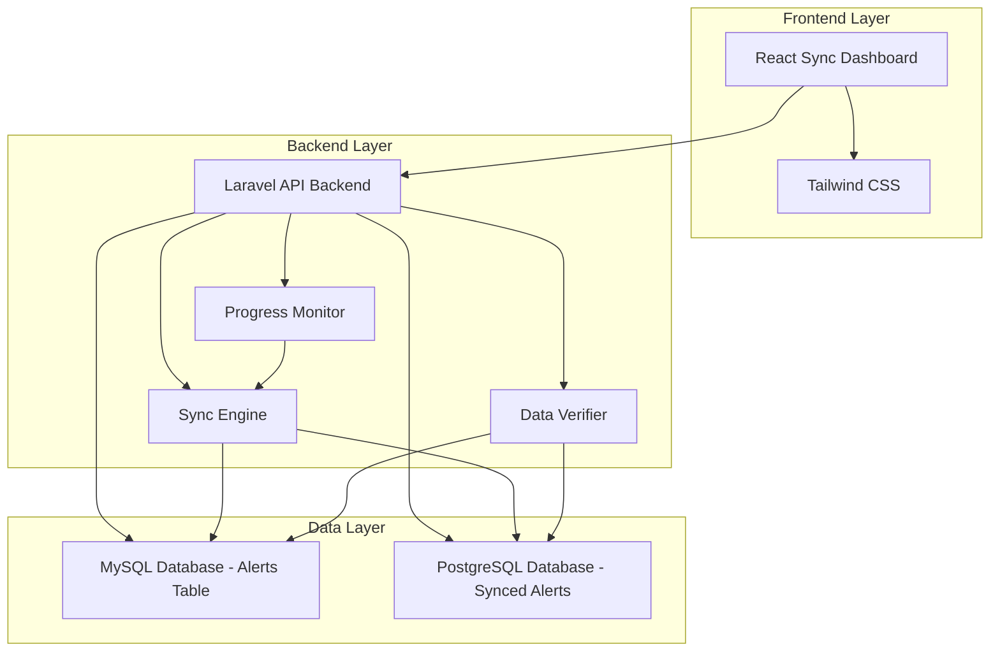

# Design Document: Dual Database Laravel React Application

## Overview

This design outlines a full-stack web application that combines Laravel as a backend API with React as the frontend, specifically designed to sync large datasets from an overloaded MySQL database to PostgreSQL. The primary focus is synchronizing the huge `alerts` table from MySQL to PostgreSQL with comprehensive monitoring, progress tracking, and data verification to enable future MySQL cleanup and load reduction.

## Architecture

The application follows a client-server architecture with clear separation between frontend and backend:



### Technology Stack

- **Frontend**: React 18+ with modern hooks and functional components
- **Backend**: Laravel 10+ with API resources, queues, and background jobs
- **Styling**: Tailwind CSS 3+ with responsive design utilities
- **Databases**: MySQL 8+ (source) and PostgreSQL 14+ (target)
- **Build Tools**: Vite for frontend bundling, Laravel Mix for asset compilation
- **Package Management**: Composer for PHP, npm for JavaScript
- **Queue System**: Laravel queues for background sync processing
- **Monitoring**: Real-time progress tracking and logging

## Components and Interfaces

### Backend Components

#### Sync Engine
- Manages the alerts table synchronization process
- Handles batch processing for large datasets
- Implements chunked data transfer to prevent memory issues
- Provides transaction safety and rollback capabilities

#### Progress Monitor
- Tracks sync progress in real-time
- Calculates completion percentages and ETAs
- Logs sync events and milestones
- Provides status updates to the frontend

#### Data Verifier
- Compares record counts between MySQL and PostgreSQL
- Validates data integrity using checksums
- Generates verification reports
- Ensures sync completion before any cleanup operations

#### Database Configuration Manager
- Manages multiple database connections
- Handles connection switching based on data requirements
- Provides connection health checks and failover logic

#### API Controllers
- RESTful endpoints for sync operations and monitoring
- Database connection routing logic
- Response formatting and error handling

#### Models and Eloquent
- Alert model for MySQL source data
- SyncedAlert model for PostgreSQL target data
- Sync progress tracking models
- Database-specific configurations

### Frontend Components

#### App Component
- Root component managing application state
- API client configuration
- Route management

#### Sync Dashboard Component
- Displays real-time sync progress and status
- Shows alerts table statistics and completion metrics
- Provides sync control buttons (start, pause, resume)
- Displays database connectivity status

#### Progress Visualization Component
- Real-time progress bars and completion percentages
- Sync speed and ETA calculations
- Record count displays (processed/total)
- Error and warning notifications

#### Database Status Component
- Connection status indicators for MySQL and PostgreSQL
- Database health metrics and performance indicators
- Alerts table size and sync statistics

#### API Service Layer
- Centralized HTTP client for backend communication
- Request/response interceptors
- Error handling and retry logic

## Data Models

### Database Schema Design

#### MySQL Database (Source)
```sql
-- Existing alerts table in MySQL (to be synced)
-- Structure will be read dynamically from existing table
-- Example structure (actual structure may vary):
CREATE TABLE alerts (
    id BIGINT UNSIGNED AUTO_INCREMENT PRIMARY KEY,
    alert_type VARCHAR(100) NOT NULL,
    message TEXT NOT NULL,
    severity ENUM('low', 'medium', 'high', 'critical') NOT NULL,
    source_system VARCHAR(255),
    created_at TIMESTAMP DEFAULT CURRENT_TIMESTAMP,
    updated_at TIMESTAMP DEFAULT CURRENT_TIMESTAMP ON UPDATE CURRENT_TIMESTAMP,
    resolved_at TIMESTAMP NULL,
    metadata JSON,
    INDEX idx_alert_type (alert_type),
    INDEX idx_severity (severity),
    INDEX idx_created_at (created_at)
);

-- Sync tracking table in MySQL
CREATE TABLE sync_progress (
    id BIGINT UNSIGNED AUTO_INCREMENT PRIMARY KEY,
    table_name VARCHAR(100) NOT NULL,
    total_records BIGINT NOT NULL,
    processed_records BIGINT DEFAULT 0,
    last_synced_id BIGINT DEFAULT 0,
    sync_status ENUM('pending', 'in_progress', 'completed', 'failed') DEFAULT 'pending',
    started_at TIMESTAMP NULL,
    completed_at TIMESTAMP NULL,
    created_at TIMESTAMP DEFAULT CURRENT_TIMESTAMP,
    updated_at TIMESTAMP DEFAULT CURRENT_TIMESTAMP ON UPDATE CURRENT_TIMESTAMP
);
```

#### PostgreSQL Database (Target)
```sql
-- Replicated alerts table in PostgreSQL (exact copy of MySQL structure)
CREATE TABLE alerts (
    id BIGSERIAL PRIMARY KEY,
    alert_type VARCHAR(100) NOT NULL,
    message TEXT NOT NULL,
    severity VARCHAR(20) NOT NULL CHECK (severity IN ('low', 'medium', 'high', 'critical')),
    source_system VARCHAR(255),
    created_at TIMESTAMP DEFAULT NOW(),
    updated_at TIMESTAMP DEFAULT NOW(),
    resolved_at TIMESTAMP NULL,
    metadata JSONB,
    synced_at TIMESTAMP DEFAULT NOW()
);

CREATE INDEX idx_alerts_alert_type ON alerts (alert_type);
CREATE INDEX idx_alerts_severity ON alerts (severity);
CREATE INDEX idx_alerts_created_at ON alerts (created_at);
CREATE INDEX idx_alerts_synced_at ON alerts (synced_at);

-- Sync verification table in PostgreSQL
CREATE TABLE sync_verification (
    id SERIAL PRIMARY KEY,
    table_name VARCHAR(100) NOT NULL,
    source_count BIGINT NOT NULL,
    target_count BIGINT NOT NULL,
    checksum_match BOOLEAN DEFAULT FALSE,
    verification_status VARCHAR(20) DEFAULT 'pending',
    verified_at TIMESTAMP DEFAULT NOW()
);
```

### Data Flow

1. **Sync Initialization**: System reads alerts table structure from MySQL and replicates it in PostgreSQL
2. **Batch Processing**: Alerts data is processed in configurable batches to prevent memory issues
3. **Progress Tracking**: Each batch completion updates sync progress in real-time
4. **Data Verification**: After sync completion, system verifies data integrity between databases
5. **Status Reporting**: Frontend displays real-time progress and final verification results
6. **Future Cleanup**: Once verification is complete, system is ready for MySQL cleanup (not implemented yet)

## Correctness Properties

*A property is a characteristic or behavior that should hold true across all valid executions of a system-essentially, a formal statement about what the system should do. Properties serve as the bridge between human-readable specifications and machine-verifiable correctness guarantees.*

### Converting EARS to Properties

Based on the prework analysis, I'll convert the testable acceptance criteria into correctness properties:

**Property 1: Database Query Routing**
*For any* database operation, the system should route queries to the correct database based on the data type and operation requirements
**Validates: Requirements 5.3**

**Property 2: Connection Failure Handling**
*For any* database connection failure scenario, the system should handle the failure gracefully without crashing and provide appropriate error responses
**Validates: Requirements 5.5**

**Property 3: Alerts Sync Data Integrity**
*For any* batch of alerts data synced from MySQL to PostgreSQL, the target data should be identical to the source data in structure and content
**Validates: Requirements 2.4**

**Property 4: Sync Progress Accuracy**
*For any* sync operation, the reported progress percentage should accurately reflect the actual number of records processed versus total records
**Validates: Requirements 3.2**

**Property 5: Data Verification Completeness**
*For any* completed sync operation, the verification process should confirm that all source records exist in the target database with matching data
**Validates: Requirements 4.2**

**Property 6: Responsive Design**
*For any* viewport size within the supported range, the React frontend should display sync monitoring content in a readable and accessible format
**Validates: Requirements 7.3**

## Error Handling

### Backend Error Handling
- Database connection failures should return appropriate HTTP status codes
- Invalid API requests should return structured error responses
- Database query errors should be logged and return generic error messages to clients
- Connection timeouts should be handled with retry logic

### Frontend Error Handling
- API request failures should display user-friendly error messages
- Network connectivity issues should be handled gracefully
- Loading states should be shown during API requests
- Error boundaries should catch and handle React component errors

### Database Error Scenarios
- MySQL connection failures should not affect PostgreSQL operations
- PostgreSQL connection failures should not affect MySQL operations
- Query timeouts should be handled with appropriate fallbacks
- Transaction rollbacks should maintain data consistency

## Testing Strategy

### Dual Testing Approach

This project will use both unit testing and property-based testing to ensure comprehensive coverage:

**Unit Tests**:
- Specific examples of API endpoints working correctly
- Database connection establishment
- React component rendering with known data
- Error handling for specific failure scenarios
- Integration points between Laravel and React

**Property Tests**:
- Universal properties that hold across all inputs
- Database query routing behavior across different operation types
- API communication patterns across various request/response combinations
- Error handling behavior across different failure modes
- Responsive design behavior across viewport size ranges

### Testing Framework Configuration

**Backend Testing (Laravel)**:
- PHPUnit for unit testing
- Laravel's built-in testing utilities for HTTP testing
- Database testing with separate test databases
- Minimum 100 iterations for property-based tests using PHPUnit data providers

**Frontend Testing (React)**:
- Jest and React Testing Library for unit testing
- Cypress for end-to-end testing
- Property-based testing using fast-check library
- Minimum 100 iterations per property test

**Property Test Tags**:
Each property test will be tagged with comments referencing the design document:
- **Feature: dual-database-laravel-react, Property 1: Database Query Routing**
- **Feature: dual-database-laravel-react, Property 2: Connection Failure Handling**
- **Feature: dual-database-laravel-react, Property 3: API Communication**
- **Feature: dual-database-laravel-react, Property 4: API Error Handling**
- **Feature: dual-database-laravel-react, Property 5: Responsive Design**

### Integration Testing
- End-to-end tests verifying complete user workflows
- Database integration tests ensuring both MySQL and PostgreSQL work correctly
- API integration tests verifying frontend-backend communication
- Build and deployment testing to ensure the application can be set up correctly