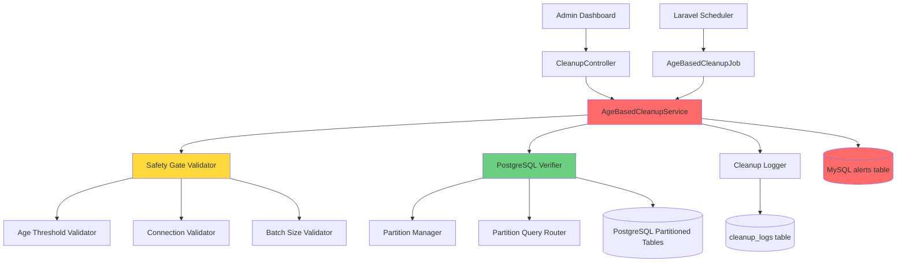
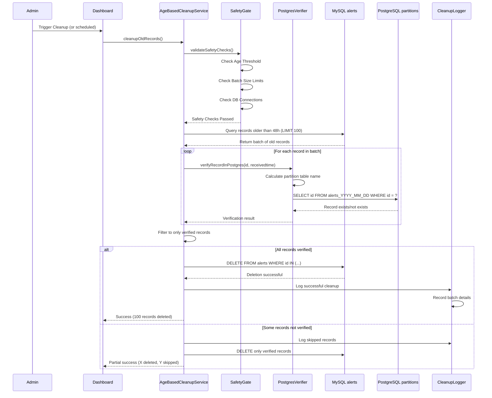
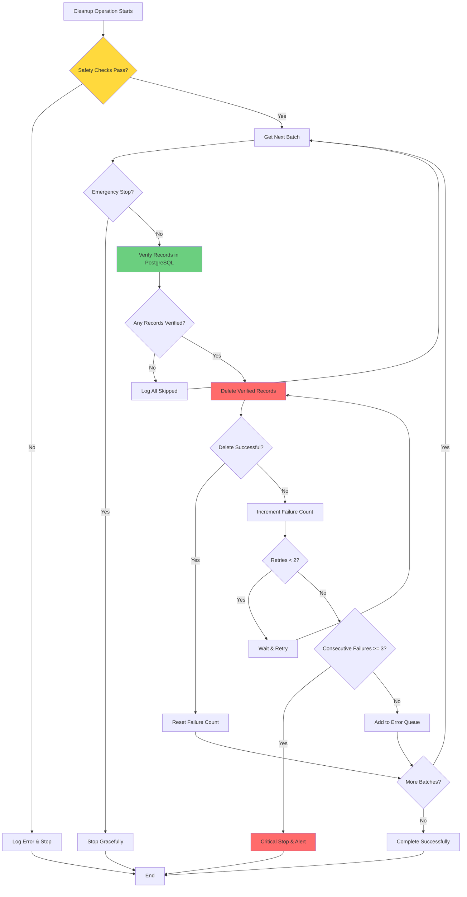

# Design Document: MySQL Alerts Age-Based Cleanup

## Overview

This design outlines a critical safety-focused cleanup system that automatically deletes old alert records from the MySQL alerts table based on age criteria. The system is designed with extreme caution as it performs irreversible DELETE operations on production data. The cleanup service will ONLY delete records that are:

1. **Older than 48 hours** (configurable Age_Threshold)
2. **Verified to exist in PostgreSQL** partitioned tables
3. **Processed in small batches** (default: 100 records per batch)
4. **Approved by administrator** through explicit confirmation

The system follows a multi-layered safety approach with verification gates at every step to prevent accidental data loss. It integrates with the existing Laravel application structure, leveraging existing services like PartitionManager for PostgreSQL verification and ConfigurationService for runtime configuration.

**⚠️ CRITICAL TESTING REQUIREMENT:**

**PHASE 1 - TESTING (alerts_2 table):**
- All development, testing, and validation will be performed on the `alerts_2` table
- The service will be configured to target `alerts_2` during this phase
- All tests, dry runs, and actual cleanup operations will only affect `alerts_2`
- The production `alerts` table will remain completely untouched
- This phase continues until all functionality is verified and approved

**PHASE 2 - PRODUCTION (alerts table):**
- Only after successful completion of Phase 1 and explicit approval
- Configuration will be updated to target the production `alerts` table
- All safety mechanisms remain in place
- Gradual rollout with monitoring

**Configuration for Table Selection:**
The target table will be configurable via:
1. Environment variable: `CLEANUP_TARGET_TABLE=alerts_2` (testing) or `CLEANUP_TARGET_TABLE=alerts` (production)
2. Configuration file setting
3. Clear code comments marking the table configuration location

## Architecture

### High-Level Architecture



### Component Interaction Flow



### Design Principles

1. **Safety First**: Multiple verification layers prevent accidental deletion
2. **Incremental Processing**: Small batches prevent table locks and performance issues
3. **Audit Trail**: Comprehensive logging of all cleanup operations
4. **Fail-Safe**: System stops on errors rather than continuing with uncertain state
5. **Configurable**: Age threshold and batch size easily adjustable
6. **Transparent**: Dry-run mode allows preview before actual deletion

## Components and Interfaces

### 1. AgeBasedCleanupService

The core service responsible for orchestrating the cleanup process.

**Responsibilities:**
- Identify records older than Age_Threshold
- Verify records exist in PostgreSQL before deletion
- Delete records in configurable batches
- Log all cleanup operations
- Enforce safety gates
- Provide dry-run preview mode

**Key Methods:**

```php
class AgeBasedCleanupService
{
    // Configuration
    private int $ageThresholdHours = 48;  // ⚠️ CONFIGURABLE: Change age threshold here
    private int $batchSize = 100;          // ⚠️ CONFIGURABLE: Change batch size here
    private int $maxBatchesPerRun = 50;    // Prevent runaway cleanup
    private int $delayBetweenBatchesMs = 100; // Delay to reduce load
    private string $targetTable = 'alerts_2'; // ⚠️ CRITICAL: Testing on alerts_2, change to 'alerts' for production
    
    // Dependencies
    private PostgresVerifier $postgresVerifier;
    private SafetyGate $safetyGate;
    private CleanupLogger $cleanupLogger;
    private bool $emergencyStop = false;
    
    /**
     * Main cleanup method - processes old records in batches
     * 
     * @param bool $dryRun If true, preview only (no deletion)
     * @return CleanupResult
     */
    public function cleanupOldRecords(bool $dryRun = false): CleanupResult;
    
    /**
     * Process a single batch of old records
     * 
     * @return BatchCleanupResult
     */
    private function processBatch(): BatchCleanupResult;
    
    /**
     * Identify records eligible for cleanup
     * 
     * @return Collection Records older than age threshold
     */
    private function getEligibleRecords(): Collection;
    
    /**
     * Verify records exist in PostgreSQL partitions
     * 
     * @param Collection $records Records to verify
     * @return array ['verified' => [...], 'missing' => [...]]
     */
    private function verifyRecordsInPostgres(Collection $records): array;
    
    /**
     * Delete verified records from MySQL
     * 
     * @param array $recordIds IDs to delete
     * @return int Number of records deleted
     */
    private function deleteRecords(array $recordIds): int;
    
    /**
     * Set age threshold dynamically
     * 
     * @param int $hours Age threshold in hours (minimum 24)
     */
    public function setAgeThreshold(int $hours): self;
    
    /**
     * Set batch size dynamically
     * 
     * @param int $size Batch size (10-1000)
     */
    public function setBatchSize(int $size): self;
    
    /**
     * Check emergency stop flag
     * 
     * @return bool
     */
    public function isEmergencyStopped(): bool;
    
    /**
     * Set emergency stop flag
     * 
     * @param bool $stop
     */
    public function setEmergencyStop(bool $stop): void;
}
```

**Configuration Location:**

The batch size, age threshold, and target table can be modified in three ways:

1. **In Code** (class constants at top of AgeBasedCleanupService.php):
```php
private int $ageThresholdHours = 48;  // ⚠️ EDIT HERE: Change age threshold
private int $batchSize = 100;          // ⚠️ EDIT HERE: Change batch size
private string $targetTable = 'alerts_2'; // ⚠️ CRITICAL: Testing on alerts_2, change to 'alerts' for production
```

2. **Via Environment Variables** (.env file):
```env
CLEANUP_AGE_THRESHOLD_HOURS=48
CLEANUP_BATCH_SIZE=100
CLEANUP_TARGET_TABLE=alerts_2  # ⚠️ CRITICAL: Use alerts_2 for testing, alerts for production
```

3. **Via Runtime API** (through ConfigurationService):
```php
$service->setAgeThreshold(72);  // Change to 72 hours
$service->setBatchSize(200);     // Change to 200 records per batch
$service->setTargetTable('alerts_2'); // ⚠️ CRITICAL: Set target table
```

### 2. SafetyGate

Validates all safety conditions before allowing cleanup to proceed.

**Responsibilities:**
- Validate age threshold is met
- Validate batch size is within limits
- Validate database connections are stable
- Validate admin confirmation exists
- Prevent cleanup if any safety check fails

**Key Methods:**

```php
class SafetyGate
{
    /**
     * Validate all safety checks before cleanup
     * 
     * @param array $context Context information for validation
     * @return SafetyCheckResult
     */
    public function validateSafetyChecks(array $context): SafetyCheckResult;
    
    /**
     * Validate age threshold
     * 
     * @param Carbon $recordTime Record timestamp
     * @param int $thresholdHours Age threshold in hours
     * @return bool
     */
    public function validateAgeThreshold(Carbon $recordTime, int $thresholdHours): bool;
    
    /**
     * Validate batch size is within limits
     * 
     * @param int $batchSize Requested batch size
     * @return bool
     */
    public function validateBatchSize(int $batchSize): bool;
    
    /**
     * Validate database connections
     * 
     * @return bool
     */
    public function validateConnections(): bool;
    
    /**
     * Validate admin confirmation
     * 
     * @return bool
     */
    public function validateAdminConfirmation(): bool;
}
```

### 3. PostgresVerifier

Verifies that records exist in PostgreSQL partitioned tables before deletion.

**Responsibilities:**
- Calculate correct partition table name based on receivedtime
- Query PostgreSQL partition to verify record exists
- Handle partition table lookup errors
- Return verification results

**Key Methods:**

```php
class PostgresVerifier
{
    private PartitionManager $partitionManager;
    private PartitionQueryRouter $queryRouter;
    
    /**
     * Verify a single record exists in PostgreSQL
     * 
     * @param int $recordId MySQL record ID
     * @param Carbon $receivedTime Record's receivedtime
     * @return bool True if record exists in PostgreSQL
     */
    public function verifyRecordExists(int $recordId, Carbon $receivedTime): bool;
    
    /**
     * Verify multiple records exist in PostgreSQL
     * 
     * @param array $records Array of ['id' => int, 'receivedtime' => Carbon]
     * @return array ['verified' => [...], 'missing' => [...]]
     */
    public function verifyRecordsBatch(array $records): array;
    
    /**
     * Get partition table name for a given date
     * 
     * @param Carbon $date
     * @return string Partition table name (e.g., 'alerts_2026_01_08')
     */
    private function getPartitionTableName(Carbon $date): string;
    
    /**
     * Check if record exists in specific partition
     * 
     * @param string $tableName Partition table name
     * @param int $recordId Record ID
     * @return bool
     */
    private function recordExistsInPartition(string $tableName, int $recordId): bool;
}
```

### 4. CleanupLogger

Logs all cleanup operations for audit trail and troubleshooting.

**Responsibilities:**
- Log cleanup operation start/end
- Log records deleted per batch
- Log records skipped due to verification failure
- Log errors and warnings
- Provide queryable cleanup history

**Key Methods:**

```php
class CleanupLogger
{
    /**
     * Log cleanup operation start
     * 
     * @param array $context Operation context
     * @return int Log entry ID
     */
    public function logCleanupStart(array $context): int;
    
    /**
     * Log cleanup operation completion
     * 
     * @param int $logId Log entry ID
     * @param CleanupResult $result Cleanup result
     */
    public function logCleanupComplete(int $logId, CleanupResult $result): void;
    
    /**
     * Log batch processing
     * 
     * @param int $logId Parent log entry ID
     * @param BatchCleanupResult $batchResult Batch result
     */
    public function logBatch(int $logId, BatchCleanupResult $batchResult): void;
    
    /**
     * Log skipped records
     * 
     * @param int $logId Parent log entry ID
     * @param array $skippedRecords Records that were skipped
     * @param string $reason Reason for skipping
     */
    public function logSkippedRecords(int $logId, array $skippedRecords, string $reason): void;
    
    /**
     * Get cleanup history
     * 
     * @param int $days Number of days to retrieve
     * @return Collection
     */
    public function getCleanupHistory(int $days = 90): Collection;
}
```

### 5. CleanupController

API controller for admin dashboard integration.

**Responsibilities:**
- Provide endpoints for manual cleanup trigger
- Provide endpoints for dry-run preview
- Provide endpoints for emergency stop
- Provide endpoints for configuration updates
- Return cleanup status and history

**Key Endpoints:**

```php
class CleanupController extends Controller
{
    /**
     * GET /api/cleanup/status
     * Get current cleanup status
     */
    public function status(): JsonResponse;
    
    /**
     * POST /api/cleanup/preview
     * Preview what would be cleaned up (dry run)
     */
    public function preview(): JsonResponse;
    
    /**
     * POST /api/cleanup/execute
     * Execute cleanup operation (requires admin confirmation)
     */
    public function execute(Request $request): JsonResponse;
    
    /**
     * POST /api/cleanup/emergency-stop
     * Set emergency stop flag
     */
    public function emergencyStop(): JsonResponse;
    
    /**
     * GET /api/cleanup/history
     * Get cleanup operation history
     */
    public function history(Request $request): JsonResponse;
    
    /**
     * PUT /api/cleanup/config
     * Update cleanup configuration
     */
    public function updateConfig(Request $request): JsonResponse;
}
```

### 6. AgeBasedCleanupJob

Scheduled job for automated cleanup execution.

**Responsibilities:**
- Run on configured schedule (default: every 6 hours)
- Check if previous run is still in progress
- Execute cleanup with configured parameters
- Handle job failures gracefully

**Key Methods:**

```php
class AgeBasedCleanupJob implements ShouldQueue
{
    use Dispatchable, InteractsWithQueue, Queueable, SerializesModels;
    
    public int $timeout = 3600; // 1 hour timeout
    public int $tries = 1;      // Don't retry automatically
    
    /**
     * Execute the job
     */
    public function handle(AgeBasedCleanupService $service): void;
    
    /**
     * Handle job failure
     */
    public function failed(Throwable $exception): void;
}
```

## Data Models

### CleanupLog Model

Stores audit trail of all cleanup operations.

**Table: cleanup_logs**

```php
Schema::create('cleanup_logs', function (Blueprint $table) {
    $table->id();
    $table->enum('operation_type', ['age_based_cleanup', 'manual_cleanup', 'dry_run']);
    $table->enum('status', ['started', 'completed', 'failed', 'stopped']);
    $table->integer('age_threshold_hours');
    $table->integer('batch_size');
    $table->integer('batches_processed')->default(0);
    $table->integer('records_deleted')->default(0);
    $table->integer('records_skipped')->default(0);
    $table->text('error_message')->nullable();
    $table->json('configuration')->nullable(); // Snapshot of config at runtime
    $table->timestamp('started_at');
    $table->timestamp('completed_at')->nullable();
    $table->integer('duration_ms')->nullable();
    $table->string('triggered_by')->nullable(); // 'scheduler', 'admin', 'api'
    $table->timestamps();
    
    $table->index('started_at');
    $table->index('status');
    $table->index('operation_type');
});
```

**Model Class:**

```php
class CleanupLog extends Model
{
    protected $fillable = [
        'operation_type',
        'status',
        'age_threshold_hours',
        'batch_size',
        'batches_processed',
        'records_deleted',
        'records_skipped',
        'error_message',
        'configuration',
        'started_at',
        'completed_at',
        'duration_ms',
        'triggered_by',
    ];
    
    protected $casts = [
        'configuration' => 'array',
        'started_at' => 'datetime',
        'completed_at' => 'datetime',
    ];
    
    // Scopes
    public function scopeRecent($query, int $days = 90);
    public function scopeSuccessful($query);
    public function scopeFailed($query);
    
    // Helper methods
    public function markCompleted(int $recordsDeleted, int $recordsSkipped): void;
    public function markFailed(string $errorMessage): void;
}
```

### CleanupBatch Model

Stores details of individual batch operations within a cleanup run.

**Table: cleanup_batches**

```php
Schema::create('cleanup_batches', function (Blueprint $table) {
    $table->id();
    $table->foreignId('cleanup_log_id')->constrained()->onDelete('cascade');
    $table->integer('batch_number');
    $table->integer('records_identified');
    $table->integer('records_verified');
    $table->integer('records_deleted');
    $table->integer('records_skipped');
    $table->json('skipped_record_ids')->nullable();
    $table->text('skip_reason')->nullable();
    $table->timestamp('processed_at');
    $table->integer('duration_ms');
    $table->timestamps();
    
    $table->index('cleanup_log_id');
    $table->index('processed_at');
});
```

### EmergencyStop Model

Stores emergency stop flag state.

**Table: emergency_stops**

```php
Schema::create('emergency_stops', function (Blueprint $table) {
    $table->id();
    $table->string('service_name')->unique(); // 'age_based_cleanup'
    $table->boolean('is_stopped')->default(false);
    $table->text('reason')->nullable();
    $table->string('stopped_by')->nullable(); // Admin user or system
    $table->timestamp('stopped_at')->nullable();
    $table->timestamp('cleared_at')->nullable();
    $table->timestamps();
});
```

### Configuration Storage

Cleanup configuration is stored using the existing ConfigurationService, which uses Laravel's cache system. The following keys are used:

- `cleanup.target_table`: Target table name (default: 'alerts_2' for testing, 'alerts' for production) **⚠️ CRITICAL SETTING**
- `cleanup.age_threshold_hours`: Age threshold in hours (default: 48)
- `cleanup.batch_size`: Records per batch (default: 100)
- `cleanup.max_batches_per_run`: Maximum batches per run (default: 50)
- `cleanup.delay_between_batches_ms`: Delay between batches in milliseconds (default: 100)
- `cleanup.schedule`: Cron expression for scheduled runs (default: '0 */6 * * *')
- `cleanup.enabled`: Whether automated cleanup is enabled (default: false)

### Result Objects

**CleanupResult:**

```php
class CleanupResult
{
    public function __construct(
        public readonly bool $success,
        public readonly int $batchesProcessed,
        public readonly int $recordsDeleted,
        public readonly int $recordsSkipped,
        public readonly array $errors,
        public readonly ?string $errorMessage,
        public readonly int $durationMs,
        public readonly bool $wasDryRun,
    ) {}
}
```

**BatchCleanupResult:**

```php
class BatchCleanupResult
{
    public function __construct(
        public readonly int $batchNumber,
        public readonly int $recordsIdentified,
        public readonly int $recordsVerified,
        public readonly int $recordsDeleted,
        public readonly int $recordsSkipped,
        public readonly array $skippedRecordIds,
        public readonly ?string $skipReason,
        public readonly int $durationMs,
    ) {}
}
```

**SafetyCheckResult:**

```php
class SafetyCheckResult
{
    public function __construct(
        public readonly bool $passed,
        public readonly array $failedChecks,
        public readonly array $warnings,
    ) {}
}
```


## Correctness Properties

*A property is a characteristic or behavior that should hold true across all valid executions of a system—essentially, a formal statement about what the system should do. Properties serve as the bridge between human-readable specifications and machine-verifiable correctness guarantees.*

### Property Reflection

After analyzing all acceptance criteria, I identified the following redundancies:

- **1.5 is redundant with 1.1**: Both test that records not meeting age criteria are excluded
- **3.3 and 3.5 are redundant with 3.1**: All test PostgreSQL verification before deletion
- **4.1 is redundant with 1.1**: Both test age threshold validation
- **4.2 is redundant with 3.1**: Both test PostgreSQL verification
- **4.4 is redundant with 2.4**: Both test batch size limits
- **7.1 is redundant with 1.2**: Both test configuration reading
- **8.2 is redundant with 2.5**: Both test transaction commits
- **10.2 is redundant with 5.2**: Both test tracking deleted records
- **12.5 is redundant with 5.1**: Both test logging start/completion
- **14.3 is redundant with 2.2**: Both test dynamic batch size configuration
- **14.4 is redundant with 7.5**: Both test dynamic age threshold configuration

The remaining properties provide unique validation value and will be implemented as property-based tests.

### Core Correctness Properties

**Property 1: Age-based record identification**

*For any* set of alert records with various receivedtime values, when identifying eligible records for cleanup, all identified records must have receivedtime older than the configured age threshold, and no records with receivedtime newer than or equal to the threshold should be identified.

**Validates: Requirements 1.1**

---

**Property 2: Timezone-aware age calculation**

*For any* alert record with a receivedtime in any timezone, the age calculation must correctly account for timezone differences when comparing against the age threshold, ensuring consistent age determination regardless of timezone.

**Validates: Requirements 1.4**

---

**Property 3: Batch size enforcement**

*For any* cleanup operation, when processing eligible records, each batch must contain at most the configured batch size number of records (or fewer if insufficient records remain), never exceeding the configured limit.

**Validates: Requirements 2.1**

---

**Property 4: Batch size validation**

*For any* batch size configuration value, the service must enforce that the value is between the minimum (10) and maximum (1000) limits, either by rejecting invalid values or clamping them to the valid range.

**Validates: Requirements 2.4**

---

**Property 5: PostgreSQL verification before deletion**

*For any* record deleted from MySQL, that record must have been verified to exist in the appropriate PostgreSQL partition table before deletion occurred.

**Validates: Requirements 3.1**

---

**Property 6: Partition table name calculation**

*For any* receivedtime timestamp, the calculated partition table name must follow the format `alerts_YYYY_MM_DD` where YYYY_MM_DD corresponds to the date portion of the receivedtime.

**Validates: Requirements 3.2**

---

**Property 7: Skipping unverified records**

*For any* record that cannot be found in PostgreSQL during verification, that record must be skipped (not deleted) and a warning must be logged with the record ID and reason.

**Validates: Requirements 3.4**

---

**Property 8: Safety check failure prevents deletion**

*For any* cleanup operation where any safety check fails (age threshold, PostgreSQL verification, connection stability, batch size limits), no records should be deleted and an error should be logged with the failure reason.

**Validates: Requirements 4.5**

---

**Property 9: Cleanup operation logging completeness**

*For any* cleanup operation (successful or failed), the cleanup log must contain a start timestamp, end timestamp, records deleted count, records skipped count, and the configuration values used (age threshold and batch size).

**Validates: Requirements 5.1, 5.2, 5.3**

---

**Property 10: Dry run mode safety**

*For any* cleanup operation executed in dry run mode, the MySQL alerts table must remain completely unchanged (no records deleted), while still identifying and returning the list of eligible records that would be deleted in a real run.

**Validates: Requirements 6.1, 6.6**

---

**Property 11: Age threshold minimum enforcement**

*For any* age threshold configuration value, the service must enforce that the value is at least 24 hours, either by rejecting values below 24 or clamping them to the minimum.

**Validates: Requirements 7.3**

---

**Property 12: Maximum batches per run limit**

*For any* cleanup operation, the service must stop processing after the configured maximum number of batches per run is reached, even if more eligible records remain.

**Validates: Requirements 8.4**

---

**Property 13: Idempotent cleanup across runs**

*For any* sequence of cleanup runs, records deleted in a previous run must not be re-identified or re-processed in subsequent runs, ensuring each record is only deleted once.

**Validates: Requirements 8.5**

---

**Property 14: Consecutive failure threshold**

*For any* cleanup operation, if 3 consecutive batch deletions fail, the cleanup must stop immediately and alert administrators, preventing further attempts in that run.

**Validates: Requirements 9.3**

---

**Property 15: Emergency stop check before each batch**

*For any* cleanup operation in progress, the emergency stop flag must be checked before processing each batch, and if the flag is set, cleanup must stop immediately without processing the current batch.

**Validates: Requirements 11.1**

---

**Property 16: Emergency stop persistence**

*For any* emergency stop flag that is set, the flag must remain set (preventing cleanup operations) until explicitly cleared by an administrator, persisting across service restarts.

**Validates: Requirements 11.2**

---

**Property 17: Concurrent run prevention**

*For any* scheduled cleanup run, if a previous cleanup run is still in progress, the new run must be skipped entirely without starting any processing.

**Validates: Requirements 12.4**


## Error Handling

### Error Categories

**1. Configuration Errors**
- Invalid age threshold (< 24 hours)
- Invalid batch size (< 10 or > 1000)
- Invalid schedule expression
- Missing required configuration

**Handling:** Reject configuration changes with validation error, log error, maintain previous valid configuration.

**2. Connection Errors**
- MySQL connection unavailable
- PostgreSQL connection unavailable
- Connection timeout during operation

**Handling:** Stop cleanup immediately, log error with connection details, set service status to error state, alert administrators.

**3. Verification Errors**
- Partition table not found
- Record not found in PostgreSQL
- Partition query timeout

**Handling:** Skip the affected record, log warning with record ID and reason, continue with next record, include skipped count in cleanup result.

**4. Deletion Errors**
- DELETE query fails
- Transaction rollback fails
- Batch deletion timeout

**Handling:** Rollback current batch, log error, retry up to 2 times with exponential backoff, if still failing after retries, add to error queue and continue with next batch.

**5. Consecutive Failure Errors**
- 3 consecutive batch deletions fail

**Handling:** Stop cleanup immediately, log critical error, alert administrators, set emergency stop flag, require manual intervention to resume.

**6. Emergency Stop**
- Emergency stop flag set during operation

**Handling:** Stop immediately after current batch completes (or before next batch starts), log reason, save progress, allow resume after flag is cleared.

### Error Recovery Strategy



### Error Logging Format

All errors are logged with the following structure:

```php
[
    'timestamp' => '2026-01-10 14:30:45',
    'service' => 'AgeBasedCleanupService',
    'operation' => 'cleanup_batch',
    'error_type' => 'deletion_error',
    'error_message' => 'DELETE query failed: Connection timeout',
    'context' => [
        'batch_number' => 5,
        'record_ids' => [12345, 12346, 12347],
        'retry_attempt' => 2,
        'consecutive_failures' => 1,
    ],
    'stack_trace' => '...',
]
```

## Testing Strategy

### Dual Testing Approach

This feature requires both unit tests and property-based tests to ensure comprehensive coverage:

- **Unit tests**: Verify specific examples, edge cases, and error conditions
- **Property tests**: Verify universal properties across all inputs

Both types of tests are complementary and necessary. Unit tests catch concrete bugs in specific scenarios, while property tests verify general correctness across a wide range of inputs.

### Property-Based Testing

**Framework:** We will use **Pest PHP** with the **pest-plugin-faker** for property-based testing in PHP/Laravel.

**Configuration:**
- Minimum 100 iterations per property test
- Each property test must reference its design document property
- Tag format: `Feature: mysql-alerts-age-based-cleanup, Property {number}: {property_text}`

**Property Test Examples:**

```php
// Property 1: Age-based record identification
test('all identified records are older than age threshold', function () {
    // Feature: mysql-alerts-age-based-cleanup, Property 1: Age-based record identification
    
    $service = new AgeBasedCleanupService();
    $service->setAgeThreshold(48);
    
    // Generate random records with various ages
    $records = collect(range(1, 100))->map(function ($i) {
        return [
            'id' => $i,
            'receivedtime' => now()->subHours(rand(0, 200)),
        ];
    });
    
    $eligible = $service->identifyEligibleRecords($records);
    
    // Assert: All eligible records are older than 48 hours
    foreach ($eligible as $record) {
        expect($record['receivedtime'])->toBeBefore(now()->subHours(48));
    }
    
    // Assert: No records newer than 48 hours are included
    $ineligible = $records->whereNotIn('id', $eligible->pluck('id'));
    foreach ($ineligible as $record) {
        expect($record['receivedtime'])->toBeAfter(now()->subHours(48));
    }
})->repeat(100);

// Property 5: PostgreSQL verification before deletion
test('all deleted records were verified in PostgreSQL', function () {
    // Feature: mysql-alerts-age-based-cleanup, Property 5: PostgreSQL verification before deletion
    
    $service = new AgeBasedCleanupService();
    $verifier = Mockery::mock(PostgresVerifier::class);
    
    // Generate random records
    $records = collect(range(1, 50))->map(function ($i) {
        return [
            'id' => $i,
            'receivedtime' => now()->subHours(rand(50, 100)),
        ];
    });
    
    // Mock verification: randomly mark some as verified
    $verifiedIds = $records->random(rand(20, 40))->pluck('id')->toArray();
    $verifier->shouldReceive('verifyRecordsBatch')
        ->andReturn([
            'verified' => $verifiedIds,
            'missing' => array_diff($records->pluck('id')->toArray(), $verifiedIds),
        ]);
    
    $result = $service->cleanupRecords($records);
    
    // Assert: Only verified records were deleted
    expect($result->recordsDeleted)->toBe(count($verifiedIds));
    expect($result->deletedIds)->toEqual($verifiedIds);
})->repeat(100);

// Property 10: Dry run mode safety
test('dry run mode never modifies the database', function () {
    // Feature: mysql-alerts-age-based-cleanup, Property 10: Dry run mode safety
    
    $service = new AgeBasedCleanupService();
    
    // Get initial record count
    $initialCount = Alert::count();
    
    // Run cleanup in dry run mode
    $result = $service->cleanupOldRecords(dryRun: true);
    
    // Assert: Record count unchanged
    expect(Alert::count())->toBe($initialCount);
    
    // Assert: Result indicates dry run
    expect($result->wasDryRun)->toBeTrue();
    expect($result->recordsDeleted)->toBe(0);
})->repeat(100);
```

### Unit Testing

**Focus Areas:**
- Configuration loading and validation
- Safety gate checks with specific scenarios
- Error handling for specific error types
- Emergency stop flag behavior
- Logging format and completeness
- API endpoint responses

**Unit Test Examples:**

```php
test('rejects age threshold below 24 hours', function () {
    $service = new AgeBasedCleanupService();
    
    expect(fn() => $service->setAgeThreshold(12))
        ->toThrow(ValidationException::class);
});

test('admin confirmation required for cleanup', function () {
    $service = new AgeBasedCleanupService();
    
    $result = $service->cleanupOldRecords();
    
    expect($result->success)->toBeFalse();
    expect($result->errorMessage)->toContain('Admin confirmation required');
});

test('emergency stop prevents cleanup', function () {
    $service = new AgeBasedCleanupService();
    $service->setEmergencyStop(true);
    
    $result = $service->cleanupOldRecords();
    
    expect($result->success)->toBeFalse();
    expect($result->batchesProcessed)->toBe(0);
});

test('logs contain all required fields', function () {
    $service = new AgeBasedCleanupService();
    $service->setAdminConfirmation(true);
    
    $result = $service->cleanupOldRecords();
    
    $log = CleanupLog::latest()->first();
    
    expect($log)->toHaveKeys([
        'started_at',
        'completed_at',
        'records_deleted',
        'records_skipped',
        'age_threshold_hours',
        'batch_size',
    ]);
});
```

### Integration Testing

**Scenarios:**
1. End-to-end cleanup with real MySQL and PostgreSQL databases
2. Scheduled job execution
3. API endpoint integration with admin dashboard
4. Emergency stop during active cleanup
5. Concurrent run prevention
6. Configuration changes during operation

### Performance Testing

**Metrics to Monitor:**
- Time per batch deletion
- Total cleanup duration
- MySQL table lock duration
- PostgreSQL verification query performance
- Memory usage during large cleanups

**Performance Targets:**
- Batch deletion: < 500ms per batch
- PostgreSQL verification: < 100ms per record
- Total cleanup: < 30 minutes for 100,000 records
- Memory usage: < 256MB

### Test Data Generation

**Generators for Property Tests:**

```php
// Generate random alert records with various ages
function generateAlertRecords(int $count): Collection
{
    return collect(range(1, $count))->map(function ($i) {
        return [
            'id' => $i,
            'panelid' => 'PANEL_' . rand(1000, 9999),
            'receivedtime' => now()->subHours(rand(0, 200)),
            'createtime' => now()->subHours(rand(0, 200)),
            'alarm' => 'Test Alarm ' . $i,
        ];
    });
}

// Generate records with specific age distribution
function generateRecordsByAge(int $oldCount, int $newCount): Collection
{
    $old = collect(range(1, $oldCount))->map(fn($i) => [
        'id' => $i,
        'receivedtime' => now()->subHours(rand(49, 200)),
    ]);
    
    $new = collect(range($oldCount + 1, $oldCount + $newCount))->map(fn($i) => [
        'id' => $i,
        'receivedtime' => now()->subHours(rand(0, 47)),
    ]);
    
    return $old->concat($new)->shuffle();
}
```

### Edge Cases to Test

1. **Empty database**: No records to clean up
2. **All records too new**: No records meet age threshold
3. **All records missing from PostgreSQL**: All records skipped
4. **Exactly batch size records**: Boundary condition
5. **One record less than batch size**: Boundary condition
6. **Timezone edge cases**: Records at midnight, DST transitions
7. **Very old records**: Records older than 1 year
8. **Concurrent cleanup attempts**: Multiple schedulers
9. **Mid-cleanup configuration change**: Age threshold changes during run
10. **Database connection loss mid-batch**: Recovery behavior

