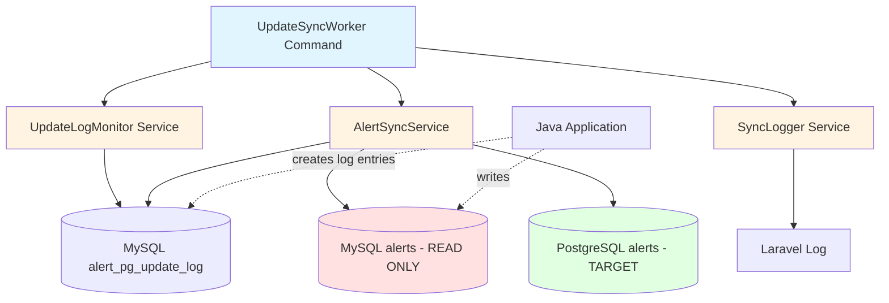
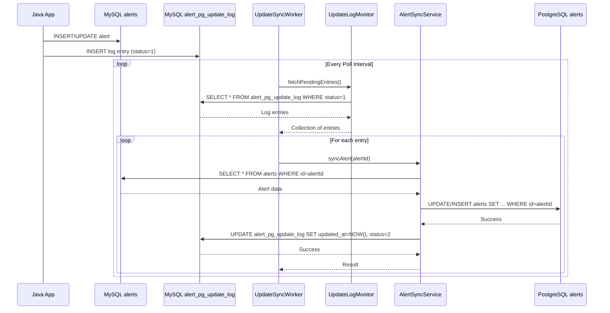
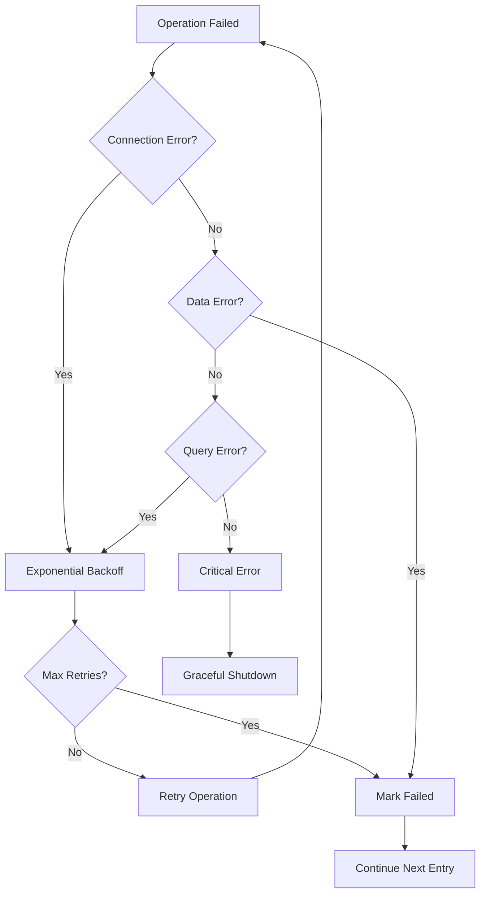

# Design Document: MySQL to PostgreSQL Update Synchronization

## Overview

This system implements a continuous synchronization worker that monitors a MySQL update log table (`alert_pg_update_log`) and propagates changes to a PostgreSQL alerts table. The worker operates as a long-running Laravel console command that polls for log entries with status=1, fetches the complete alert data from MySQL (the source of truth written by a Java application), updates the corresponding PostgreSQL record, and marks the log entry as processed.

The design leverages Laravel's database abstraction layer, Eloquent models, and console command infrastructure to provide a robust, maintainable solution that integrates with the existing dual-database application architecture.

**Key Data Flow**:
- Java application writes/updates records in **MySQL alerts** (source of truth)
- **MySQL alert_pg_update_log** tracks which alerts need syncing to PostgreSQL
- Sync worker reads from **MySQL alerts** and updates **PostgreSQL alerts** (target)
- Worker updates **MySQL alert_pg_update_log** to mark entries as processed
- **MySQL alerts table is READ-ONLY** from the sync worker's perspective

## Architecture

### System Components



### Component Responsibilities

1. **UpdateSyncWorker Command**: Laravel console command that runs indefinitely, orchestrating the sync process
2. **UpdateLogMonitor Service**: Polls the MySQL update log table and retrieves pending entries
3. **AlertSyncService**: Fetches alert data from MySQL and updates PostgreSQL records
4. **SyncLogger Service**: Provides structured logging with performance metrics

### Data Flow



## Components and Interfaces

### 1. UpdateSyncWorker Command

Laravel console command that serves as the entry point for the sync worker.

**Location**: `app/Console/Commands/UpdateSyncWorker.php`

**Interface**:
```php
class UpdateSyncWorker extends Command
{
    protected $signature = 'sync:update-worker 
                            {--poll-interval=5 : Seconds between polls}
                            {--batch-size=100 : Max entries per batch}
                            {--max-retries=3 : Max retries for failed operations}';
    
    protected $description = 'Continuously sync PostgreSQL alert updates to MySQL';
    
    public function handle(): int;
    private function processEntries(Collection $entries): void;
    private function shouldContinue(): bool;
}
```

**Responsibilities**:
- Parse command-line options
- Initialize services
- Run infinite loop with configurable poll interval
- Handle graceful shutdown on SIGTERM/SIGINT
- Log worker lifecycle events

### 2. UpdateLogMonitor Service

Monitors the MySQL update log table and retrieves pending entries.

**Location**: `app/Services/UpdateLogMonitor.php`

**Interface**:
```php
class UpdateLogMonitor
{
    public function __construct(
        private int $batchSize = 100
    ) {}
    
    public function fetchPendingEntries(): Collection;
    public function getOldestPendingTimestamp(): ?Carbon;
    public function getPendingCount(): int;
}
```

**Responsibilities**:
- Query MySQL `alert_pg_update_log` for entries with status=1
- Order entries by created_at (oldest first)
- Limit results to batch size
- Provide metrics on pending entries

### 3. AlertSyncService

Handles the core synchronization logic for individual alerts.

**Location**: `app/Services/AlertSyncService.php`

**Interface**:
```php
class AlertSyncService
{
    public function __construct(
        private SyncLogger $logger,
        private int $maxRetries = 3
    ) {}
    
    public function syncAlert(int $logEntryId, int $alertId): SyncResult;
    private function fetchAlertFromMysql(int $alertId): ?array;
    private function updateAlertInPostgres(int $alertId, array $data): bool;
    private function markLogEntryProcessed(int $logEntryId, bool $success, ?string $error = null): void;
    private function retryWithBackoff(callable $operation, string $context): mixed;
}
```

**Responsibilities**:
- Fetch complete alert record from MySQL (read-only)
- Update or insert PostgreSQL alert record with all columns
- Set updated_at timestamp in PostgreSQL
- Mark log entry as processed in MySQL alert_pg_update_log
- Handle errors and retries with exponential backoff
- Return detailed sync results

### 4. SyncLogger Service

Provides structured logging with performance metrics.

**Location**: `app/Services/SyncLogger.php`

**Interface**:
```php
class SyncLogger
{
    public function logCycleStart(int $pendingCount): void;
    public function logCycleComplete(int $processed, int $failed, float $duration): void;
    public function logAlertSync(int $alertId, bool $success, float $duration, ?string $error = null): void;
    public function logError(string $context, Exception $e, array $data = []): void;
    public function logWarning(string $message, array $context = []): void;
    public function logInfo(string $message, array $context = []): void;
}
```

**Responsibilities**:
- Log processing cycles with metrics
- Log individual alert sync operations
- Log errors with full context
- Provide performance metrics (duration, throughput)

### 5. SyncResult Value Object

Encapsulates the result of a sync operation.

**Location**: `app/Services/SyncResult.php`

**Interface**:
```php
class SyncResult
{
    public function __construct(
        public readonly bool $success,
        public readonly int $alertId,
        public readonly ?string $errorMessage = null,
        public readonly ?float $duration = null
    ) {}
    
    public function isSuccess(): bool;
    public function isFailed(): bool;
}
```

## Data Models

### MySQL: alert_pg_update_log Table

```sql
CREATE TABLE alert_pg_update_log (
    id INT AUTO_INCREMENT PRIMARY KEY,
    alert_id INT NOT NULL,
    status TINYINT NOT NULL DEFAULT 1,
    created_at TIMESTAMP NOT NULL DEFAULT CURRENT_TIMESTAMP,
    updated_at TIMESTAMP NULL,
    error_message TEXT NULL,
    retry_count INT NOT NULL DEFAULT 0,
    INDEX idx_status_created (status, created_at),
    INDEX idx_alert_id (alert_id)
) ENGINE=InnoDB DEFAULT CHARSET=utf8mb4;
```

**Status Values**:
- `1`: Pending (needs processing)
- `2`: Completed successfully
- `3`: Failed (permanent failure after retries)

**Notes**:
- This table is written by the Java application when alerts are created/updated
- The sync worker reads from this table and updates it after processing
- Located in MySQL database alongside the alerts table

### MySQL: alerts Table

The source of truth for alert data, written by the Java application. Schema is dynamic and determined at runtime.

**Key Characteristics**:
- Primary key: `id`
- Contains all alert columns to be synced
- **READ-ONLY from sync worker perspective** - worker only performs SELECT queries
- Written/updated by Java application

### PostgreSQL: alerts Table

The target table that receives updates from MySQL.

**Key Characteristics**:
- Primary key: `id`
- Must have matching `id` values with MySQL
- Schema should match MySQL (column names may differ based on existing mappings)
- `updated_at` timestamp column updated on each sync
- Worker performs INSERT or UPDATE operations here

## Correctness Properties

*A property is a characteristic or behavior that should hold true across all valid executions of a system—essentially, a formal statement about what the system should do. Properties serve as the bridge between human-readable specifications and machine-verifiable correctness guarantees.*

### Property 1: Status-Based Query Filtering

*For any* set of log entries with mixed status values, querying for pending entries should return only those entries where status equals 1.

**Validates: Requirements 1.2**

### Property 2: Processing Order Preservation

*For any* batch of log entries retrieved from the update log, the entries should be ordered by created_at timestamp in ascending order (oldest first).

**Validates: Requirements 1.3**

### Property 3: Alert ID Extraction

*For any* log entry with status=1, the alert_id value should be correctly extracted and used for subsequent database queries.

**Validates: Requirements 2.1, 2.2**

### Property 4: Complete Column Retrieval

*For any* alert record found in PostgreSQL, all column values should be retrieved (no columns should be omitted from the result set).

**Validates: Requirements 2.3**

### Property 5: Alert Data Consistency

*For any* successfully synced alert, all column values in the PostgreSQL alerts table should match the corresponding values from the MySQL alerts table at the time of sync.

**Validates: Requirements 3.2**

### Property 6: PostgreSQL Timestamp Update

*For any* alert that is successfully updated in PostgreSQL, the updated_at timestamp should be set to a value greater than or equal to the sync operation start time.

**Validates: Requirements 3.3**

### Property 7: Update Atomicity

*For any* alert update operation, either all columns should be updated in PostgreSQL or none should be updated (no partial updates).

**Validates: Requirements 3.4**

### Property 8: Missing Alert Error Handling

*For any* alert_id that does not exist in MySQL, the system should log an error and mark the log entry status as failed. If the alert exists in MySQL but the PostgreSQL insert/update fails, the system should also mark the entry as failed.

**Validates: Requirements 2.4, 3.5**

### Property 9: Log Entry Status Transition

*For any* log entry that is processed, the status should transition from 1 (pending) to either 2 (completed) or 3 (failed), and the updated_at timestamp should be set to a non-null value.

**Validates: Requirements 4.1, 4.2, 4.3**

### Property 10: Error Message Recording

*For any* log entry that fails processing, the error_message field should be populated with a non-empty string describing the failure.

**Validates: Requirements 4.4**

### Property 11: Log Entry Persistence

*For any* log entry update (status change or timestamp update), the changes should be persisted to the database and retrievable in subsequent queries.

**Validates: Requirements 4.5**

### Property 12: Retry Backoff Monotonicity

*For any* failed operation that is retried multiple times, the wait time between consecutive retry attempts should increase monotonically (each delay >= previous delay).

**Validates: Requirements 5.1**

### Property 13: Error Isolation

*For any* batch of log entries where some entries fail processing, the successful entries should still be processed and marked as completed.

**Validates: Requirements 5.2**

### Property 14: Error Logging Completeness

*For any* error that occurs during processing, the log entry should contain timestamp, context information, alert_id (if applicable), and error message.

**Validates: Requirements 5.4**

### Property 15: Batch Size Compliance

*For any* configured batch size N, the number of log entries fetched in a single poll should not exceed N.

**Validates: Requirements 6.1**

### Property 16: Processing Cycle Logging

*For any* processing cycle, a log entry should be created containing the cycle timestamp, number of entries processed, and number of entries failed.

**Validates: Requirements 7.1**

### Property 17: Alert Update Logging

*For any* alert that is processed (successfully or unsuccessfully), a log entry should be created containing the alert_id and the processing status.

**Validates: Requirements 7.2**

### Property 18: Performance Metrics Logging

*For any* processing cycle, performance metrics including total processing time and average time per entry should be logged.

**Validates: Requirements 7.3**

## Error Handling

### Error Categories

1. **Connection Errors**
   - PostgreSQL connection failure
   - MySQL connection failure
   - Network timeouts
   - **Handling**: Retry with exponential backoff (1s, 2s, 4s, 8s, max 60s)

2. **Data Errors**
   - Alert not found in PostgreSQL
   - Alert not found in MySQL
   - Column type mismatch
   - **Handling**: Mark log entry as failed (status=3), log error details, continue processing

3. **Query Errors**
   - SQL syntax errors
   - Constraint violations
   - Deadlocks
   - **Handling**: Retry up to max_retries, then mark as failed

4. **System Errors**
   - Out of memory
   - Disk full
   - **Handling**: Log critical error, graceful shutdown

### Error Recovery Strategy



### Retry Configuration

```php
// Exponential backoff configuration
$retryConfig = [
    'max_retries' => 3,
    'base_delay' => 1000, // milliseconds
    'max_delay' => 60000, // milliseconds
    'multiplier' => 2,
];

// Delay calculation: min(base_delay * (multiplier ^ attempt), max_delay)
```

### Error Logging

All errors are logged with:
- Timestamp
- Error category
- Alert ID (if applicable)
- Log entry ID
- Full error message and stack trace
- Context data (query, parameters, etc.)

## Testing Strategy

### Unit Tests

Unit tests verify specific examples and edge cases:

1. **UpdateLogMonitor Tests**
   - Test fetching pending entries with various batch sizes
   - Test empty result handling
   - Test ordering by created_at

2. **AlertSyncService Tests**
   - Test successful sync flow
   - Test alert not found in PostgreSQL
   - Test alert not found in MySQL
   - Test retry logic with mocked failures
   - Test log entry status updates

3. **SyncLogger Tests**
   - Test log message formatting
   - Test metric calculations

### Property-Based Tests

Property-based tests verify universal properties across all inputs. Each test runs a minimum of 100 iterations with randomized inputs.

**Testing Framework**: Laravel with Pest PHP and pest-plugin-faker for property-based testing

**Test Configuration**:
```php
// In tests/Feature/UpdateSync/PropertyTests.php
uses(Tests\TestCase::class)->in('Feature/UpdateSync');

// Each property test runs 100 iterations
test()->repeat(100);
```

**Property Test Implementations**:

1. **Property 1: Status-Based Query Filtering**
   - Generate random log entries with mixed status values (0, 1, 2, 3)
   - Query for pending entries
   - Verify only status=1 entries are returned
   - **Tag**: Feature: pg-mysql-update-sync, Property 1: Status-Based Query Filtering

2. **Property 2: Processing Order Preservation**
   - Generate random log entries with various created_at timestamps
   - Fetch batch
   - Verify entries are ordered by created_at ascending
   - **Tag**: Feature: pg-mysql-update-sync, Property 2: Processing Order Preservation

3. **Property 5: Alert Data Consistency**
   - Generate random alert records with various column types and values in MySQL
   - Sync to PostgreSQL
   - Verify all column values match between MySQL and PostgreSQL
   - **Tag**: Feature: pg-mysql-update-sync, Property 5: Alert Data Consistency

4. **Property 6: PostgreSQL Timestamp Update**
   - Generate random alert updates
   - Record sync start time
   - Perform sync
   - Verify PostgreSQL updated_at >= start time
   - **Tag**: Feature: pg-mysql-update-sync, Property 6: PostgreSQL Timestamp Update

5. **Property 9: Log Entry Status Transition**
   - Generate random log entries
   - Process them (some succeed, some fail)
   - Verify status transitions from 1 to 2 or 3
   - Verify updated_at is set to non-null
   - **Tag**: Feature: pg-mysql-update-sync, Property 9: Log Entry Status Transition

6. **Property 12: Retry Backoff Monotonicity**
   - Generate random failure scenarios
   - Record retry delays
   - Verify each delay >= previous delay
   - **Tag**: Feature: pg-mysql-update-sync, Property 12: Retry Backoff Monotonicity

7. **Property 13: Error Isolation**
   - Generate batches with some entries that will fail (missing alerts)
   - Process batch
   - Verify successful entries are marked as completed
   - Verify failed entries are marked as failed
   - **Tag**: Feature: pg-mysql-update-sync, Property 13: Error Isolation

8. **Property 15: Batch Size Compliance**
   - Generate more log entries than batch size
   - Configure various batch sizes
   - Fetch batch
   - Verify returned count <= configured batch size
   - **Tag**: Feature: pg-mysql-update-sync, Property 15: Batch Size Compliance

### Integration Tests

Integration tests verify end-to-end flows:

1. **Full Sync Cycle Test**
   - Insert test log entries in PostgreSQL
   - Run worker for one cycle
   - Verify MySQL updates
   - Verify log entry status updates

2. **Graceful Shutdown Test**
   - Start worker
   - Send SIGTERM
   - Verify current batch completes
   - Verify clean shutdown

3. **Database Failure Recovery Test**
   - Start worker
   - Simulate database connection failure
   - Verify retry behavior
   - Verify recovery when connection restored

### Performance Tests

1. **Throughput Test**: Measure records processed per second under various batch sizes
2. **Memory Test**: Verify memory usage remains stable over extended runs
3. **Latency Test**: Measure time from log entry creation to MySQL update completion

### Test Database Setup

Tests use separate test databases:
- MySQL: `esurv_test` (contains alerts and alert_pg_update_log tables)
- PostgreSQL: `reporting_app_test` (contains alerts table as target)

Migrations create required tables before each test suite.
