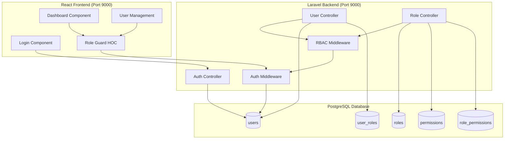
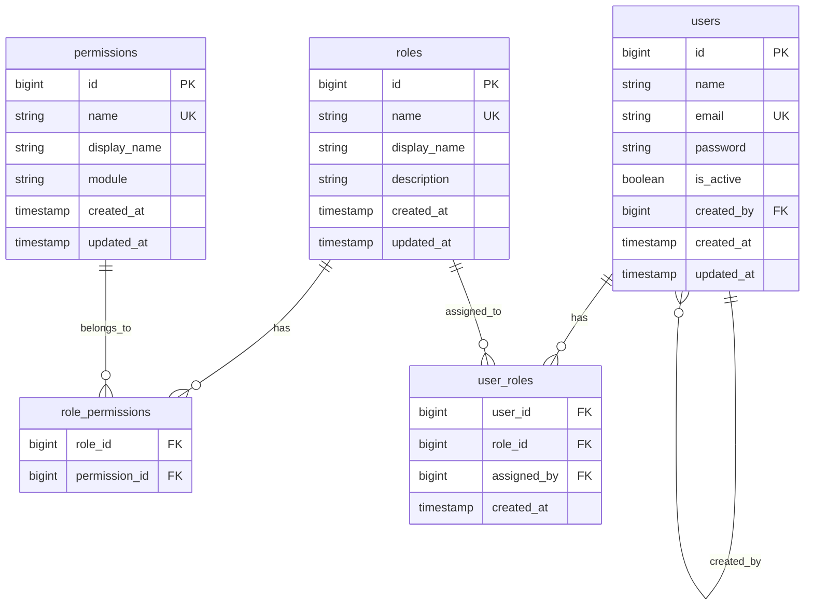

# Design Document: RBAC User Management System

## Overview

This design document outlines the architecture for a Role-Based Access Control (RBAC) system built with Laravel (backend) and React (frontend). The system uses PostgreSQL as the primary database and implements a three-tier role hierarchy: Superadmin → Admin → Manager. The application runs on port 9000.

## Architecture



## Components and Interfaces

### Backend Components

#### 1. Authentication System

```php
// AuthController Interface
interface AuthControllerInterface {
    public function login(Request $request): JsonResponse;
    public function logout(Request $request): JsonResponse;
    public function me(Request $request): JsonResponse;
}

// Login Request Structure
{
    "email": "string",
    "password": "string"
}

// Login Response Structure
{
    "user": {
        "id": "integer",
        "name": "string",
        "email": "string",
        "role": "string"
    },
    "token": "string",
    "permissions": ["string"]
}
```

#### 2. User Management Controller

```php
// UserController Interface
interface UserControllerInterface {
    public function index(Request $request): JsonResponse;      // GET /api/users
    public function store(Request $request): JsonResponse;      // POST /api/users
    public function show(int $id): JsonResponse;                // GET /api/users/{id}
    public function update(Request $request, int $id): JsonResponse; // PUT /api/users/{id}
    public function destroy(int $id): JsonResponse;             // DELETE /api/users/{id}
}
```

#### 3. RBAC Middleware

```php
// Middleware checks permission before allowing access
class RBACMiddleware {
    public function handle(Request $request, Closure $next, string $permission): Response;
}

// Permission check flow:
// 1. Extract user from authenticated session
// 2. Get user's role
// 3. Check if role has required permission
// 4. Allow or deny access
```

#### 4. Role and Permission Models

```php
// Role Model
class Role {
    public int $id;
    public string $name;        // 'superadmin', 'admin', 'manager'
    public string $display_name;
    public string $description;
    public Collection $permissions;
    public Collection $users;
}

// Permission Model
class Permission {
    public int $id;
    public string $name;        // 'users.create', 'users.read', etc.
    public string $display_name;
    public string $module;      // 'users', 'roles', 'dashboard'
    public Collection $roles;
}
```

### Frontend Components

#### 1. Dashboard Component

```jsx
// Dashboard displays role-specific content
interface DashboardProps {
    user: User;
    permissions: string[];
}

// Dashboard sections by role:
// Superadmin: System stats, all users, all roles, audit logs
// Admin: Manager list, permission assignment, limited stats
// Manager: Assigned tasks, personal stats
```

#### 2. Role Guard HOC

```jsx
// Higher-Order Component for permission-based rendering
interface RoleGuardProps {
    requiredPermission: string;
    children: ReactNode;
    fallback?: ReactNode;
}

// Usage: <RoleGuard requiredPermission="users.create">...</RoleGuard>
```

#### 3. User Management Components

```jsx
// UserList - displays users based on role permissions
// UserForm - create/edit user form
// UserCard - individual user display with actions
```

## Data Models

### Database Schema



### Default Roles and Permissions

```
Roles:
├── superadmin
│   └── All permissions
├── admin
│   ├── users.read
│   ├── users.create (managers only)
│   ├── users.update (managers only)
│   ├── users.delete (managers only)
│   ├── permissions.read
│   ├── permissions.assign (to managers)
│   └── dashboard.view
└── manager
    ├── dashboard.view
    └── (additional permissions assigned by admin)

Permissions:
├── users.create
├── users.read
├── users.update
├── users.delete
├── roles.read
├── roles.create
├── roles.update
├── roles.delete
├── permissions.read
├── permissions.assign
└── dashboard.view
```

## Correctness Properties

*A property is a characteristic or behavior that should hold true across all valid executions of a system-essentially, a formal statement about what the system should do. Properties serve as the bridge between human-readable specifications and machine-verifiable correctness guarantees.*


### Property 1: Authentication Correctness

*For any* user credentials submitted to the login endpoint, the system should authenticate successfully if and only if the email exists, the password matches the stored hash, and the user is active.

**Validates: Requirements 1.1, 1.2, 2.3**

### Property 2: Password Security

*For any* user created in the system, the stored password value should never equal the plaintext password provided during creation.

**Validates: Requirements 1.4**

### Property 3: Session Invalidation Round-Trip

*For any* authenticated user, logging out and then attempting to access a protected resource should result in authentication failure.

**Validates: Requirements 1.3**

### Property 4: User Creation Persistence

*For any* valid user data submitted by a Superadmin, creating the user should result in that user existing in the database with the exact specified attributes and role.

**Validates: Requirements 2.1**

### Property 5: Email Uniqueness Constraint

*For any* two users in the system, their email addresses must be different. Attempting to create a user with an existing email should fail with a validation error.

**Validates: Requirements 2.5**

### Property 6: Role Permission Inheritance

*For any* user assigned to a role, the user should have exactly the permissions associated with that role - no more, no less.

**Validates: Requirements 3.2, 2.2**

### Property 7: Permission Enforcement

*For any* user and any protected resource, access should be granted if and only if the user's role includes the required permission. Unauthorized access should return 403 Forbidden.

**Validates: Requirements 3.4, 5.1, 5.2**

### Property 8: Admin Scope Restriction

*For any* Admin user, they should only be able to create/modify/delete Manager users, and should only be able to assign permissions that are within their delegatable set. Attempts to modify Superadmin or Admin accounts should fail.

**Validates: Requirements 4.1, 4.2, 4.3**

### Property 9: Role-Based User Visibility

*For any* Admin viewing the user list, the response should contain only Manager users (not Superadmins or other Admins). For Superadmins, all users should be visible.

**Validates: Requirements 2.4, 4.4**

### Property 10: Unauthenticated Request Rejection

*For any* protected API endpoint and any request without valid authentication, the response should be 401 Unauthorized.

**Validates: Requirements 9.7**

## Error Handling

### Authentication Errors

| Error Code | Condition | Response |
|------------|-----------|----------|
| 401 | Invalid credentials | `{"error": "Invalid email or password"}` |
| 401 | Missing token | `{"error": "Unauthenticated"}` |
| 401 | Expired token | `{"error": "Token expired"}` |
| 403 | Account deactivated | `{"error": "Account is deactivated"}` |

### Authorization Errors

| Error Code | Condition | Response |
|------------|-----------|----------|
| 403 | Insufficient permissions | `{"error": "You do not have permission to perform this action"}` |
| 403 | Role restriction | `{"error": "You cannot modify users of this role"}` |

### Validation Errors

| Error Code | Condition | Response |
|------------|-----------|----------|
| 422 | Invalid input | `{"errors": {"field": ["error message"]}}` |
| 422 | Duplicate email | `{"errors": {"email": ["The email has already been taken"]}}` |

### Database Errors

| Error Code | Condition | Response |
|------------|-----------|----------|
| 500 | Connection failed | `{"error": "Database connection failed"}` |
| 500 | Query failed | `{"error": "An error occurred while processing your request"}` |

## Testing Strategy

### Unit Tests

Unit tests will verify specific examples and edge cases:

1. **Authentication Tests**
   - Login with valid credentials returns token
   - Login with invalid password returns 401
   - Login with non-existent email returns 401
   - Login with deactivated account returns 403

2. **User Management Tests**
   - Superadmin can create users with any role
   - Admin can only create Manager users
   - Duplicate email validation works
   - User deactivation prevents login

3. **Permission Tests**
   - Middleware correctly blocks unauthorized access
   - Role permissions are correctly inherited
   - Permission changes propagate to users

### Property-Based Tests

Property-based tests will use a PBT library (e.g., PHPUnit with data providers or Pest with datasets) to verify universal properties:

1. **Authentication Property Tests** (min 100 iterations)
   - Generate random valid/invalid credentials
   - Verify authentication correctness property

2. **Permission Enforcement Property Tests** (min 100 iterations)
   - Generate random user/permission combinations
   - Verify access is granted iff permission exists

3. **Role Scope Property Tests** (min 100 iterations)
   - Generate random Admin actions on various user types
   - Verify Admin scope restrictions hold

### Test Configuration

- Framework: PHPUnit with Laravel testing utilities
- Property testing: Data providers with randomized inputs
- Minimum iterations: 100 per property test
- Tag format: `@feature rbac-user-management @property {number}: {property_text}`

## API Endpoints Summary

| Method | Endpoint | Permission Required | Description |
|--------|----------|---------------------|-------------|
| POST | /api/auth/login | None | User login |
| POST | /api/auth/logout | Authenticated | User logout |
| GET | /api/auth/me | Authenticated | Get current user |
| GET | /api/users | users.read | List users |
| POST | /api/users | users.create | Create user |
| GET | /api/users/{id} | users.read | Get user details |
| PUT | /api/users/{id} | users.update | Update user |
| DELETE | /api/users/{id} | users.delete | Deactivate user |
| GET | /api/roles | roles.read | List roles |
| GET | /api/permissions | permissions.read | List permissions |
| GET | /api/dashboard | dashboard.view | Get dashboard data |
